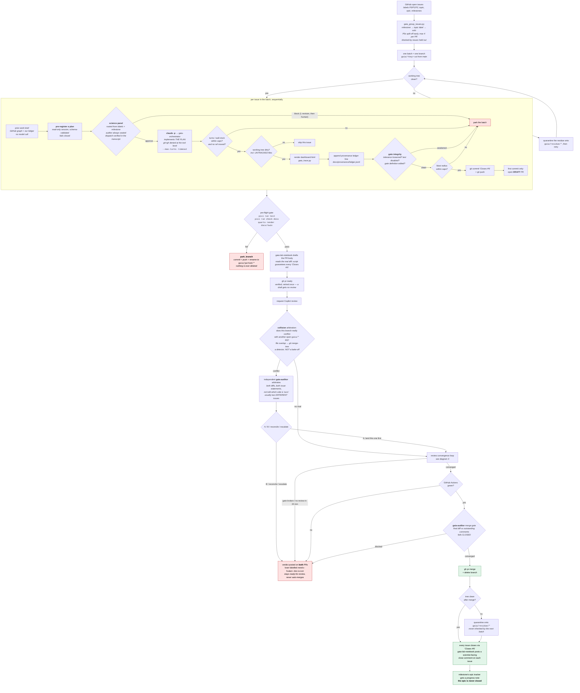
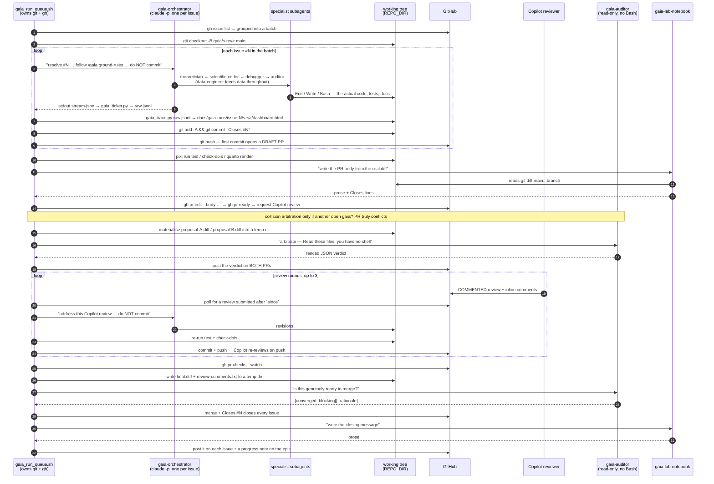
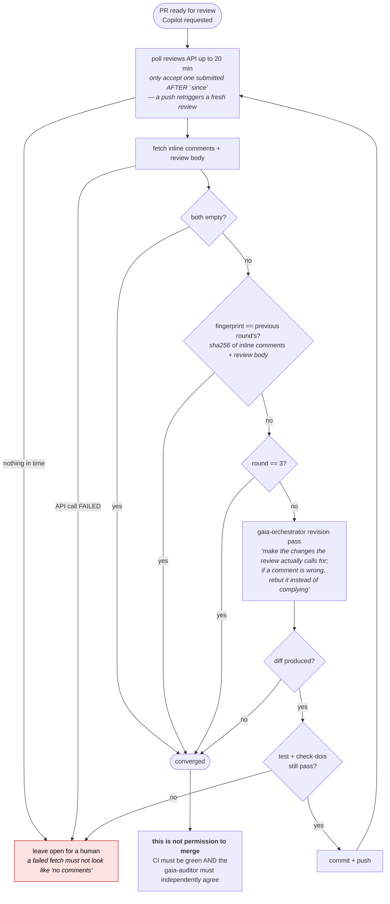
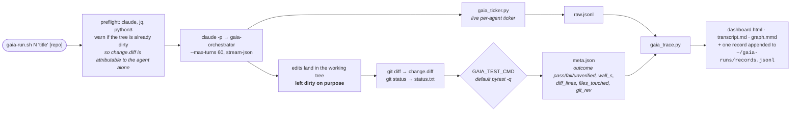

# Running the gaia agents unattended, in sync with GitHub

This describes the remote-server automation that works the open issue backlog with the
**gaia** agent family (`.claude/gaia/plugins/gaia`), independently of any interactive
Claude Code session, and keeps GitHub as the source of truth throughout. The moving parts:

| File | Role |
|---|---|
| `scripts/gaia_bootstrap.sh` | One-time setup on a fresh remote Linux box |
| `scripts/gaia_group_issues.py` | Groups open issues into PR-sized batches (the queue) |
| `scripts/gaia_run_queue.sh` | Runs the queue: orchestrator → PR → arbitration → review → auditor gate → merge |
| `scripts/gaia-launch/gaia_ticker.py` | Live per-agent ticker while a batch runs |
| `scripts/gaia-launch/gaia_trace.py` | Renders a transcript into the HTML dashboard |
| `scripts/gaia-launch/gaia_brief.py` | Prior-work brief for an issue (GitHub + our ledger) |
| `scripts/gaia-launch/gaia_plan.py` | The pre-registered plan: schema, validation, declared-vs-actual |
| `scripts/gaia-launch/gaia_panel.py` | Routes the science panel, verifies dispatch, aggregates verdicts |
| `scripts/gaia-launch/gaia_gate_integrity.py` | Detects an agent weakening the gate it is judged by |
| `scripts/gaia-launch/gaia_failsig.py` | Stable failure signatures, for the three-strikes rule |
| `scripts/gaia-launch/gaia_pr_dashboard.sh` | Renders and stages the dashboard for one PR |
| `scripts/gaia-launch/gaia_runs_site_index.py` | Builds the index over all published dashboards |

> **The safety model, in nine invariants.** Everything below follows from these:
>
> 1. **Nothing is ever deleted.** Failure parks work — committed, pushed, renamed out of the
>    way. The only automatic branch removal is after a successful merge.
> 2. **Gates fail closed.** An unparseable verdict, a timeout, or an unreachable service
>    blocks a merge; it never waves one through.
> 3. **One loop, one PID, one stop command.** The queue is killable as a unit, not
>    child-by-child.
> 4. **Publication is verified before any work starts**, so a broken `gh`/auth path costs
>    seconds rather than a full batch.
> 5. **A PR is never left in draft.** Draft PRs get no code review, so the queue marks each
>    PR ready, *verifies* it took, and requests review before anything can block it. Work
>    that is held back is labelled, not hidden.
> 6. **The working tree is clean at every batch boundary.** A batch starts clean or it does
>    not start; a merged batch leaves it clean. Residue is quarantined onto its own branch,
>    never inherited by the next batch and never committed under somebody else's `Closes #N`.
> 7. **Every agent invocation is bounded before it starts** — turns, wall clock, files and
>    lines it may touch, and the tools it may reach. The gates further down protect `main`;
>    these protect the tree, the clock and the bill.
> 8. **The science is judged before the code exists.** Every issue is pre-registered as a
>    plan from a read-only session, and a routed panel of read-only science personas — with
>    the auditor always seated — must pass it before any editing agent runs. A block stops
>    implementation.
> 9. **An agent may not weaken the thing that judges it.** Loosened tolerances, disabled
>    tests and edited gate definitions are detected mechanically in the staged diff and
>    block the commit. Passing by softening the gate is not passing.

## The pipeline at a glance

Four views of the same machine: the **batch lifecycle** (what happens to a set of issues),
the **agent/artifact interaction** (who touches the code, and when), the **review
convergence loop** (the Copilot iteration), and the **single-issue harness**
(`gaia-run.sh`, which is a different tool with a different purpose).

### 1. Batch lifecycle — issues in, merged `main` out



Every red path leaves the PR **open** and the issues **open**, with a log. Nothing merges
on a guess, and no failure path deletes work.

### 2. Who touches the code — agents, the working tree, and GitHub

The shell script owns git; the agents own the edits. The orchestrator is invoked as a
**fresh, non-interactive `claude -p` process per issue** — it has no memory of the previous
issue in the batch, and each invocation is explicitly told *not* to commit.



Two things worth noticing in that sequence:

- **The auditor has no shell.** Its tool grant is Read/Grep/Glob/WebSearch/WebFetch/Skill,
  by design — so the *caller* materialises the diffs and review comments into a temp
  directory and hands the auditor file paths to `Read`. An auditor that could run `git`
  could also change the thing it is judging.

  That grant covers the **subagent**, and for a long time the sandbox stopped there. The
  queue reaches the auditor through a top-level `claude -p` session that has the *full*
  tool set — Bash included — and merely delegates; nothing structurally stopped that
  wrapper from touching git, and the diff-materialisation dance was a convention rather
  than an enforced boundary. Every auditor and lab-notebook invocation now passes
  `--disallowed-tools` denying `Edit`, `Write`, `NotebookEdit` and every git/gh mutation,
  so the fence reaches the wrapper too.
- **The Provenance Keeper agent is bypassed here — its ledger is not.** In an interactive
  session that agent commits; in the queue the shell script does, because it must guarantee
  the `Closes #N` trailer and must convert a failed commit into a controlled park rather
  than a `set -e` death. Bypassing the *agent* is fine; dropping the *record* was not, and
  until recently there was no provenance artifact in this repo at all. The queue now
  appends one JSON line per issue to `docs/provenance/ledger.jsonl` **before** staging, so
  the entry is committed alongside the code it describes.

### 3. The Copilot iteration, in detail

Copilot's code review **never** submits an `APPROVED` state — only ever `COMMENTED`. Waiting
for approval would hang forever, so convergence is defined by *content*, and Copilot alone
can never gate a merge.



An unchanged fingerprint reads identically whether the revision pass *addressed* the
feedback or *ignored* it. That ambiguity is exactly why the auditor gate exists downstream:
a merge needs **both** signals — Copilot quiet **and** an independent auditor satisfied.

### 4. `gaia-run.sh` — the single-issue harness, which does something else

`scripts/gaia-launch/gaia-run.sh` is **not** a step in the queue. It runs the orchestrator on
*one* issue with no branch, no PR, no review and no merge, and archives the whole trajectory
plus a pass/fail signal into a corpus — it is the evaluation/observation harness, not the
delivery pipeline.



The difference in one line: **`gaia-run.sh` only measures; `gaia_run_queue.sh` ships *and*
measures.** The harness deliberately leaves the tree dirty and writes down what the agent
did; the queue commits, reviews, gates and merges — and, since the clean-tree/guardrail
work, writes the same corpus record for every issue it attempts.

Both now append to `records.jsonl` in the **same schema** (`gaia_trace.py --records --meta`),
with a `delivery` object present only on queue records (branch, PR, dashboard, and the caps
that invocation ran under). Before this, the delivery path rendered a dashboard a human
could read and then discarded every number on it — so "is the pipeline getting better?" was
unanswerable, and only "did that run feel bad?" was available. The queue's records carry the
batch's real gate outcome (`pass` / `fail` / `unverified`), stamped once the gate has
actually run rather than guessed at commit time, and **failed batches are recorded too** — a
corpus of successes teaches nothing.

## What it does, end to end

For each batch of related issues (see grouping, below):

1. Branch off `main`, run the **gaia orchestrator** to resolve the batch **one issue at a
   time**, so each fix lands as its own commit naming the issue it closes.
2. Local pre-flight gate: `pixi run test`, `pixi run check-dois`, and a `quarto render` of
   the twin book. Any failure **parks** the branch (see *When a batch fails*) and leaves the
   issues open — nothing half-broken reaches review or merge.
3. Open **one draft PR** for the batch on the first commit, then swap in a real description
   drafted by the `gaia-lab-notebook` agent (reads the actual diff, explains it in plain
   language, ends with one `Closes #N` per issue) and mark it ready for review.
4. **Collision arbitration.** Read the name literally. Batches are cut from `main` in
   parallel, so two batches can land incompatible edits in the same module without either
   agent seeing the other.

   > **This is a collision detector, not a bake-off.** The pair it judges is whatever two
   > branches happened to touch the same files, and they are almost always resolving
   > *different* issues — PR #215 (sparse GMRF/SPDE Matérn, issue #163) and PR #216
   > (stationary-grid covariance, issue #154) collided in `observability.py` while
   > answering two different questions. "Which is better, A or B?" is not even well posed
   > for such a pair, which is why `reconcile` is a first-class verdict. A verdict of `A`
   > means *A should land first*, *not* that the project has chosen design A.
   >
   > A genuine A/B would need the **same issue set** resolved twice, on two branches, by
   > two independent orchestrator runs, and only then arbitrated. That is a different
   > mechanism and this is not it. What this stage is genuinely good for is making a
   > silent, incompatible double-merge impossible.
 The branch is tested against every other open `gaia/*` PR —
   changed-file overlap as a prefilter, then `git merge-tree` as the real conflict test. On
   a genuine conflict an **independent `gaia-auditor`** receives both diffs and both issue
   statements, is not told which side is "ours", and returns a verdict
   (`A` / `B` / `reconcile` / `escalate`). The verdict is posted on **both** PRs; the losing
   side is labelled `needs-human-decision` and never auto-merges. It deliberately stays
   **ready for review**, not demoted to draft: a draft PR gets no code review, and the
   human adjudicating a design collision needs a review of *both* sides in front of them.
5. Request a **Copilot code review** on the PR and wait for it (up to 20 minutes).
6. **Revise and re-review, up to `REVIEW_MAX_ROUNDS` (default 3) rounds**: feed Copilot's
   comments back to the orchestrator, let it address what's actually called for, re-run the
   local gate, push, and wait for a fresh review. Copilot's review **never** reaches an
   "Approve" state — only ever `COMMENTED` — so this loop tracks a fingerprint of its
   comments, not the review state.
7. Wait for **GitHub Actions checks** on the PR to go green.
8. **Auditor merge gate.** Copilot going quiet is necessary but *not* sufficient: an
   unchanged comment fingerprint reads the same whether the revision pass addressed the
   feedback or ignored it. An independent `gaia-auditor` reads the final diff against the
   outstanding comments and must confirm that each substantive comment is addressed or
   correctly rebutted, that the change resolves the issues it claims to close, and that it
   introduces no new problems. It **fails closed** — unparseable output blocks the merge —
   and posts its verdict on the PR either way. A merge needs **both** signals.
9. **Squash-merge.** Every issue in the batch closes via the `Closes #N` lines. Each
   issue (and the PR) gets the same scientist-facing closing message, again drafted by
   `gaia-lab-notebook`. If the batch belongs to a milestone, that milestone's `epic`
   tracker issue gets a one-line progress comment — **the epic itself is never closed
   by this script.**

Any failure at any stage (orchestrator errors, gate fails, arbitration ruling against the
branch, no Copilot review in time, revision breaks the gate, checks red, auditor blocks)
stops that batch, leaves the PR/issues open, and moves on to the next. Nothing merges on a
guess, and **nothing is ever deleted.**

## Grouping the queue

`scripts/gaia_group_issues.py` decides what becomes one PR. Grouping key, in order:

1. **Milestone**, if the issue has one — this repo's milestones are already curated
   epics (e.g. *"Water budget: vadose-zone physics & calibration"*, *"Applied math: DA
   estimator correctness"*), each with its own `epic`-labeled tracker issue. Trusted
   over any label heuristic.
2. Otherwise, the first matching **topic label** (`dv-v`, `water-budget`, `geotech`,
   `landlab`, `stage-3`, `stage-2`, `stage-1`, `hydrogeology`, `soil-reanalysis`,
   `atmospheric`, `uncertainty`, `validation`, `peer-review`, `documentation`, `bug`,
   `enhancement` — in that priority order).
3. Otherwise, the issue is its own solo batch.

Within a group, any `P0`-labeled issues split off into their own, earlier batch — a
blocking-correctness fix never waits behind exploratory `P2` work just because they
share an epic. Groups are capped at **4 issues per PR** (`MAX_BATCH` in the script) so a
single review stays tractable; oversized groups split into ordered chunks. Batches run
in order of their worst (highest-priority) member: all `P0` batches first, then `P1`,
then `P2`.

`epic`-labeled issues are trackers, never work items, and are always excluded from
batches.

To preview what the queue would do without running anything:

```bash
python3 scripts/gaia_group_issues.py | jq -c '{key, branch, issues: [.issues[].number]}'
```

## One-time setup

On the remote Linux box, as the user that will own the automation (not root):

```bash
export REPO_URL="git@github.com:gaia-hazlab/gwl-space-time-smooth.git"   # SSH remote
export REPO_DIR="$HOME/gwl-space-time-smooth"
bash scripts/gaia_bootstrap.sh
```

This installs `pixi` (the pinned env, matching CI), the `gh` CLI, the Claude Code CLI,
Quarto, clones the repo, and registers the gaia plugin
(`claude plugin marketplace add ./.claude/gaia && claude plugin install gaia@gaia`).

Three credentials it does **not** set up for you, on purpose:

- **Git over SSH** — `git clone`/`git push` use the SSH remote, so the box needs a
  private key that can push to this repo (copy an existing key over, or generate a
  fresh deploy key on the box and add its public half under repo → Settings → Deploy
  keys, with write access). This is independent of the `gh` CLI login below.
- **`gh` CLI auth** — every `gh issue list` / `gh pr create` / `gh pr merge` / the
  Copilot-reviewer request in `gaia_run_queue.sh` goes through this, not SSH:
  ```bash
  echo "$GH_TOKEN" | gh auth login --with-token   # needs repo + workflow scopes
  ```
- **`ANTHROPIC_API_KEY`** — put it in a mode-600 file, a systemd `EnvironmentFile`, or a
  secret manager. **Never in the repo, and never typed inline on the command line**: an
  inline `export` is written verbatim to `~/.bash_history`, where it persists in plaintext
  long after the run and is trivial to leak in a screen share or a pasted terminal log.

  ```bash
  install -m 600 /dev/null "$HOME/.config/gaia/env"
  printf 'ANTHROPIC_API_KEY=%s\n' 'sk-ant-...' >> "$HOME/.config/gaia/env"
  # then, per shell:  set -a; . "$HOME/.config/gaia/env"; set +a
  ```

Before the first real run, sanity-check both:

```bash
ssh -T git@github.com
git -C "$REPO_DIR" push --dry-run origin main
gh auth status
```

The script's own `preflight` re-checks the parts it depends on at every launch and refuses
to start if they are broken, but these confirm the SSH push path it cannot test without
writing.

Also verify the Copilot reviewer login once by hand (open any PR in the GitHub UI,
check who "Copilot" resolves to as a requested reviewer) — `gaia_run_queue.sh` hardcodes
`copilot-pull-request-reviewer[bot]` at the top; update it there if your org differs.

One more org-dependent flag: arbitration returns a losing PR to draft with
`gh pr ready --undo`, which GitHub documents as available *"if supported by your plan."*
Confirm it works on one throwaway PR; if it does not, arbitration still posts its verdict
and still refuses to merge — the PR just stays marked ready.

If `main` has a ruleset/branch-protection rule requiring an approving review, note that
**Copilot's code review never submits "Approve"** — only ever `COMMENTED` — so a plain
`required_approving_review_count` will block this pipeline's merge step forever, no matter
how many revision rounds run. The fix used on this repo: add the automation's GitHub
identity (the same account/token `gh auth login` uses) as a **bypass actor** on the
ruleset, with `bypass_mode: "pull_request"` (bypasses the review/status-check requirement
on merge only — direct-push protections like `deletion`/`non_fast_forward` still apply to
that identity). Via the API:

```bash
gh api user --jq '.id'   # numeric actor_id for the account gaia_run_queue.sh authenticates as
# then PUT the ruleset (see its current rules via `gh api repos/{owner}/{repo}/rulesets/{id}`)
# with bypass_actors: [{"actor_id": <id>, "actor_type": "User", "bypass_mode": "pull_request"}]
```

Confirm the merge step actually works end-to-end once — if the bypass isn't configured, or a
CODEOWNERS file later makes `require_code_owner_review` bite, the merge fails loudly, which
is the safe outcome, but you won't get the close-the-loop behavior until it's resolved.

## Running it safely

### Always look at the queue first

The script drains the **entire** open backlog by default, and the backlog is usually deeper
than it looks — on this repo it currently builds around 40 batches, i.e. around 40 PRs.
Budget roughly **20–90 minutes per issue**, and note that each issue is a separate `claude
-p` invocation with its own API spend. A full drain is a multi-day commitment, not an
overnight one. Look before you launch:

```bash
# how many PRs am I authorizing?
python3 scripts/gaia_group_issues.py | wc -l

# what are they, in execution order?
python3 scripts/gaia_group_issues.py | jq -c '{key, branch, issues: [.issues[].number]}'
```

Batch JSON goes to **stdout**; the grouper also writes `holding back #N: blocked by open
#M` lines to **stderr** for issues whose declared dependencies are still open. Those are
worth reading — they are the issues the queue is deliberately *not* attempting yet:

```bash
python3 scripts/gaia_group_issues.py 2>&1 >/dev/null   # dependency diagnostics only
```

### Start with one batch

```bash
cd "$REPO_DIR"
set -a; . "$HOME/.config/gaia/env"; set +a     # ANTHROPIC_API_KEY, mode-600 file — never inline
GAIA_MAX_BATCHES=1 scripts/gaia_run_queue.sh
```

Do **not** type `export ANTHROPIC_API_KEY=sk-ant-...` on the command line: it lands in
`~/.bash_history` in plaintext. Keep it in a mode-600 file and source it.

The script prints its own stop command at startup and runs a **preflight** before touching
anything — `gh auth status`, the `gh` sub-flags it depends on, and `jq`/`python3`/`git` on
`PATH`. If the publication path is broken it exits immediately, having changed nothing. A
credential or CLI problem therefore costs you seconds at launch rather than surfacing after
a batch has already done its work.

### Knobs

| Variable | Default | Effect |
|---|---|---|
| `GAIA_MAX_BATCHES` | `0` | `0` drains the queue; `N` stops after N batches, leaving the rest untouched |
| `GAIA_ARBITRATION` | `1` | `0` disables rival-PR conflict arbitration (not recommended) |
| `GAIA_AUDIT_GATE` | `1` | `0` disables the auditor merge gate (not recommended) |
| `REVIEW_MAX_ROUNDS` | `3` | Cap on Copilot revise-and-re-review rounds |
| `GAIA_MAX_TURNS` | `80` | Agent turns per orchestrator invocation |
| `GAIA_AUX_MAX_TURNS` | `30` | ... per auditor / lab-notebook invocation |
| `GAIA_ISSUE_TIMEOUT` | `5400` | Wall-clock seconds per issue, then `TERM` (then `KILL` after 60s) |
| `GAIA_AUX_TIMEOUT` | `1200` | Wall clock for the short-lived agents |
| `GAIA_MAX_FILES` | `40` | Blast radius: files one issue may touch before the batch is parked |
| `GAIA_MAX_DIFF_LINES` | `4000` | Blast radius: added + removed lines |
| `GAIA_MAX_COST_USD` | `0` | `0` = uncapped; otherwise halt the queue between issues past this |
| `GAIA_SCIENCE_GATE` | `1` | `0` skips plan pre-registration and the science panel (not recommended) |
| `GAIA_PLAN_REVISIONS` | `1` | Plan revisions allowed after a panel block, before parking |
| `GAIA_GATE_INTEGRITY` | `1` | `0` disables gate-weakening detection (not recommended) |
| `GAIA_FAIL_STRIKES` | `3` | Identical failure signatures tolerated before a line is stopped |

### The science gate — judging the plan before the code exists

The pipeline had one mechanical definition of "done": `pixi run test`. Nothing consumed a
theoretician's judgment, so under gate pressure the orchestrator's shortest path to green
was always the scientific-coder, and the science personas were structurally decorative.
Calling them more often would not have changed that — **a gate has to depend on them.**

So before any editing agent runs:

1. **A prior-work brief** is assembled with no model call, from the GitHub graph and our own
   ledger and corpus: which issues this one references and their state, which PRs already
   touched it (merged first — those are settled), and what this queue itself already tried
   and with what outcome. The orchestrator used to be handed three lines and no history,
   which is the single largest avoidable token cost in the pipeline and a standing risk of
   redoing settled work.
2. **The orchestrator pre-registers a plan** from a **read-only** session: the obstruction,
   the ordered testable questions, the approach, the artifacts, a declared budget in files /
   lines / runtime, the stopping conditions, what would count as a **reproducible negative
   result**, and what is explicitly out of scope. It is validated against a schema and
   **fails closed** — an unparseable plan is not a plan, and proceeding without one silently
   reverts to the old behaviour. A plan declaring more than 40 files or 4000 lines is
   rejected outright: an agent may not pre-authorise a sprawling diff by predicting one.
3. **A routed panel of PROJECT personas reviews it.** Personas are selected from the issue's
   own labels and milestone, and the **auditor sits on every panel** (ground rule 1: the
   maker is never the sole judge). Capped at three to bound cost. Every persona is read-only
   by tool grant, so this stage physically cannot touch the tree.

   The domain reviewers are **specific to this twin** (`.claude/agents/twin-*.md`), not the
   general gaia family, because a generic reviewer does not know this project's own history.
   Each was derived from this repository's review record and carries its ranked concerns as
   priors to verify:

   | Persona | Derived from | Routed by |
   |---|---|---|
   | `twin-hydrogeologist` | `peer_review.md` §1 | `hydrogeology`, `water-budget`, `soil-reanalysis`, `stage-1` |
   | `twin-geotech-engineer` | `peer_review.md` §2 | `geotech`, `landlab`, liquefaction/landslide/Vs30 milestones |
   | `twin-atmospheric-scientist` | `peer_review.md` §3 | `atmospheric`, flood milestone |
   | `twin-geostatistician` | sensor-uncertainty review, 2026-08 prior audit | `uncertainty`, `validation`, `dv-v`, `stage-2` |
   | `twin-da-methodologist` | DA-estimator-correctness milestone, 2026-08 audit | `stage-3`, "Applied math", "probabilistic" |

   Genuinely-software or documentation issues still route to the general `gaia-debugger` and
   `gaia-lab-notebook`: not every issue in this repo is a question about the twin's science.
4. **Concerns must name a decisive test.** A concern with no test that would settle it is an
   opinion, and opinions do not block work. A `block`, or any `critical` concern, stops
   implementation; one revision is allowed, then the issue is labelled for a human.
5. **The plan and every verdict are posted to the issue** before implementation — so the
   scientific reasoning is on the record at the moment it could still have changed the
   approach, rather than reconstructed afterwards from a diff.

This is our own **ground rule 3** ("design-review first — audit a plan once before resources
are spent") made mechanical. The queue had never once done it.

#### The personas are verified, not assumed

"Use the gaia-auditor agent" is prose. Whether the session actually *delegated* — and
therefore whether that persona's system prompt, tool grant and model tier were ever loaded —
is a fact recorded in the transcript, as a `Task` dispatch carrying a `subagent_type`. Real
queue runs do dispatch them (issue #154's run dispatched seven), but the count varies, and a
verdict from a session that never dispatched is the base model in costume: the persona's
name, none of its charter.

So each panel call runs with `--output-format stream-json` and the transcript is checked for
the expected `subagent_type`. A missing dispatch fails **closed** to a block. Project personas
resolve as a bare name and plugin personas as `gaia:<name>`; `gaia_panel.py --expect-for` owns
that mapping so it lives in one place.

Preflight refuses to start if the gaia plugin is not installed, or if any project persona file
is missing — both failures degrade the judges silently while still returning confident
verdicts, which is worse than a batch that refuses to begin.

Verified by real dispatch, not by reading: a probe run of `twin-hydrogeologist` produced a
transcript containing `subagent_type: twin-hydrogeologist`.

### An agent may not weaken its own judge

An agent told to make `pixi run test` pass has two routes: fix the code, or soften the gate.
Nothing distinguished them, and the second is invisible in a green CI run — which is what
makes it dangerous in a numerics repository, where loosening one `rtol` turns a failing
convergence claim into a passing one without a line of physics changing.

`gaia_gate_integrity.py` reads the **staged** diff and blocks on:

| Signal | Why it blocks |
|---|---|
| `@pytest.mark.skip` / `xfail` added | Turns a failing test green without touching the code under test |
| A tolerance raised (`rtol`, `atol`, `places`, …) | A weaker numeric check can manufacture a convergence result |
| An assertion bound raised (`assert err < 1e-10` → `1e-2`) | Same, in bare form |
| An existing gate definition altered or removed | Changes what the gate *runs*, not whether the code passes it |

Net loss of tests or assertions is reported as a **warning**, never a block — a genuine
refactor produces it too. Adding a *stricter* task is explicitly fine: the check triggers on
removed gate lines, not added ones, and comments are stripped before matching. It carries no
model and no opinions: every finding names a file, the before/after text, and why.

### Three strikes on the same failure

The queue already refuses to loop on Copilot — it fingerprints the review payload and stops
when the fingerprint stops changing. The agent's own failures had no such check, so a
revision pass could reproduce an identical traceback round after round, each one a full
orchestrator invocation that learned nothing.

`gaia_failsig.py` reduces a pytest run to a stable signature — test id, exception type, and
the *shape* of the message, with paths, addresses and numeric values normalised out. Failing
at `0.031` and then at `0.029` against the same expectation is one unresolved problem, not
two discoveries; counting them separately is exactly the loop this breaks. After
`GAIA_FAIL_STRIKES` identical signatures the line stops and the batch is left for a human.

### Bounding a run

Every gate described above is **downstream**: it refuses to merge. Downstream gates protect
`main`. They do nothing about an invocation that spends eight hours and $200 rewriting two
hundred files before the first gate ever runs — and the numbers are not hypothetical: a
single real issue in the 2026-08-18 run (`#154`) cost **$15.93** across **195 tool calls**
and **8 agents**. Forty batches of that is a four-figure bill.

So there is now an **upstream** layer, bounding what one invocation may consume and touch:

| Bound | Mechanism | What it catches |
|---|---|---|
| Turns | `--max-turns` on every `claude -p` | An agent that has lost the plot and is looping |
| Wall clock | `timeout --signal=TERM --kill-after=60` | An agent that has deadlocked and is burning only time |
| Blast radius | staged `git diff --cached` vs the caps, checked *before* the commit | A runaway refactor, a stray build artifact, foreign residue |
| Spend | summed `total_cost_usd` from the transcript, checked *between* issues | The bill |
| Tools | `--disallowed-tools` for every git/gh mutation | An agent committing, pushing, branching or merging |
| Version control | `assert_no_vcs_mutation` — HEAD+branch snapshotted before each invocation, compared after | The above, *when the CLI fence fails or is absent* |

Two notes on that table.

**`--max-turns` was the asymmetry.** `gaia-run.sh` — the *measurement* harness, which ships
nothing — capped turns at 60. `gaia_run_queue.sh` — the *delivery* harness, which commits,
pushes and merges — capped nothing. The unbounded path was the one with write access.

**The last row is the one that matters.** Every other bound is enforced by `claude` itself,
and the entire point of a runaway guard is that it has to hold when the thing it is guarding
misbehaves. Snapshotting version control around each invocation and proving afterwards that
no ref moved is the only check here the script fully owns. It is also the answer to a
finding from the 2026-08-17/18 post-mortem: §3.6 confirms the "do not commit" instruction
was present *verbatim in all nineteen sessions*, and it did not prevent the incident.
**Prose is not a guardrail.** These deny the tool and then verify the outcome.

The caps are deliberately generous — they are runaway detectors, not budgets. If a batch
legitimately needs more, raise the variable for that run; the failure mode is a parked
branch with a clear message, never lost work.

### Stopping it

**The loop and the agent are different processes.** The queue script is the parent; each
issue runs as a `claude -p` child. Killing the child you can see in `htop` does *not* stop
the queue — the parent simply starts the next issue, and the run appears to continue after
you believe you have ended it. Stop the **loop**:

```bash
kill "$(cat .gaia-runs/gaia_run_queue.pid)"
```

That requests a graceful stop: the current issue finishes, its work is committed and
pushed, and the queue halts before the next batch.

A second `TERM` kills **immediately**. Work already committed is safe on the branch, but
anything uncommitted at that instant stays in the working tree and is not pushed — so
prefer the single, graceful stop unless you need the process gone now.

Confirm it is actually gone (the loop, not just a child):

```bash
pgrep -af gaia_run_queue.sh          # should print nothing
pgrep -af 'claude -p Use the gaia'   # should print nothing
```

The PID file also prevents a second concurrent run: launching while one is live exits with
the running PID. The `flock` in the cron example below is belt-and-braces on top of that.

### Unattended, recurring

```cron
*/30 * * * * flock -n /tmp/gaia_run_queue.lock /path/to/scripts/gaia_run_queue.sh >> $HOME/gwl-space-time-smooth/.gaia-runs/cron.log 2>&1
```

For a cron schedule, consider `GAIA_MAX_BATCHES=1` so each wake-up does one batch and
exits, rather than one wake-up occupying the box for hours.

### When a batch fails

Failure **parks**, it never deletes. `park_branch` commits any uncommitted work as an
explicitly-labelled `gaia WIP (parked, unreviewed)` commit, pushes the branch, and renames
the local ref so the next batch cannot clobber it:

```
gaia/parked/<original-branch-name>-<timestamp>
```

The remote branch and any draft PR are left in place. To see what is parked and recover it:

```bash
git branch --list 'gaia/parked/*'
git log --oneline main..gaia/parked/<name>          # what it contains
git checkout gaia/parked/<name>                     # pick it up locally
git fetch origin <original-branch-name>             # or fetch the pushed copy
```

Parked branches accumulate deliberately — they are the recovery material. Prune them
yourself once you have decided each one's fate. The **only** automatic branch removal left
is `gh pr merge --delete-branch`, i.e. after the work is safely in `main`, plus a `git
branch -d` for a no-op batch that is provably identical to `main` with a clean tree.

## Monitoring a run

Three views, from most live to most durable.

### 1. Live, over your shoulder

Each batch streams a per-agent ticker to the console *and* to its log, so you can watch
which agent is doing what in real time:

```bash
tail -f .gaia-runs/batch-*-$(date -u +%Y%m%d)T*.log
```

```
  [main #1] Skill  {"skill": "gaia:ground-rules"}
  [main #2] Bash   {"command": "gh issue view 154 ...
  [gaia:gaia-scientific-coder #12] Bash  {"command": "pixi run pytest ...
```

`[agent #n]` is the agent name and its call index — `main` is the top-level session,
anything else is a subagent. This comes from `gaia_ticker.py`, which sits between `claude`
and `tee` and passes the transcript through untouched.

At the end of each issue the ticker prints a summary table — the fastest way to see whether
an agent was thrashing:

```
agent                        calls  errors  tools
main                            27       0  Bash x18, Agent x5, ToolSearch x2, Skill x1
gaia:gaia-orchestrator          38       1  Read x18, Grep x13, Glob x4, Agent x2
gaia:gaia-scientific-coder      44       1  Bash x43, Read x1
```

### 2. The logs on disk

| Path | Contents | Committed? |
|---|---|---|
| `.gaia-runs/batch-<first-issue>-<ts>.log` | Everything the batch did, including git and `gh` output | no (gitignored) |
| `.gaia-runs/issue-<n>-<ts>.raw.jsonl` | Raw `stream-json` transcript for that issue | no (gitignored) |
| `.gaia-runs/gaia_run_queue.pid` | The loop's PID | no |
| `.gaia-runs/cron.log` | Cron wrapper output | no |
| `.gaia-runs/records.jsonl` | One corpus record per issue attempted — outcome, cost, turns, tool histogram, subagent roster, `delivery` block | no |
| `docs/provenance/ledger.jsonl` | One provenance line per issue — `parent_rev`, PR, dashboard, transcript, `pixi.lock` hash, total spend, the gate that ran, and the AI-assistance statement | **yes**, in the same commit as the code |

The last row is deliberately committed rather than gitignored: provenance that lives only in
`.gaia-runs/` dies with the box it ran on. The entry carries `parent_rev` rather than its own
commit sha, because it has to be written *before* the commit in order to land inside it —
`parent_rev` plus the commit containing the line identifies the change completely, and git
supplies the resulting sha.

**The batch log is the first place to look when a batch didn't do what you expected.** Its
`!!!` lines are the failure reports, each followed by the last 40 lines of context:

```bash
grep -n '!!!' .gaia-runs/batch-*.log          # every failure across every run
grep -n 'parked\|arbitration verdict\|auditor:' .gaia-runs/batch-*.log
```

### 3. The dashboards

For every issue that produced a commit, the queue renders a **self-contained HTML
dashboard** — the agent call graph, the full transcript, tool counts, cost and duration —
and commits it *in the same commit as the code it documents*:

```
docs/gaia-runs/issue-<n>/<timestamp>/dashboard.html
```

Because they are committed, they are published by the `quarto-pages` workflow on merge,
with a generated index over all of them:

- **Index:** <https://gaia-hazlab.github.io/gwl-space-time-smooth/gaia-runs/>
- **One run:** `https://gaia-hazlab.github.io/gwl-space-time-smooth/gaia-runs/issue-<n>/<timestamp>/dashboard.html`

### A dashboard per PR, not only per issue

The queue renders one dashboard per **issue** and commits it beside the code it documents,
which covers every PR the queue opens itself. A PR raised from an **interactive** session
produced none — so the published index silently omitted exactly the work a human had been
involved in, which is the work whose provenance matters most.

```bash
scripts/gaia-launch/gaia_pr_dashboard.sh 218          # newest session transcript for this repo
scripts/gaia-launch/gaia_pr_dashboard.sh 218 path/to/session.jsonl   # or name it explicitly
```

It renders through the same `gaia_trace.py` (so the same secret redaction applies), titles
the page from the PR rather than the session UUID, writes
`docs/gaia-runs/pr-<n>/<timestamp>/dashboard.html`, and stages it. Commit it with the PR it
documents. The index generator discovers `issue-*` and `pr-*` alike and labels each row.

The transcript auto-detection picks the most recently modified session file for this repo.
That is a convenience, not a guarantee — if more than one session contributed to the PR,
pass the path explicitly.

Note the dashboards only appear on the site **after the PR merges**. To read one before
that, open the file from the branch, or render it yourself from any transcript — including
a run that never got committed:

```bash
# from a queue transcript
python3 scripts/gaia-launch/gaia_trace.py .gaia-runs/issue-154-20260818T101610Z.raw.jsonl \
  --html /tmp/issue-154.html

# or from an interactive session file (--title beats a UUID heading)
python3 scripts/gaia-launch/gaia_trace.py \
  ~/.claude/projects/-home-mdenolle-gwl-space-time-smooth/<session-id>.jsonl \
  --html /tmp/s.html --title "PR #218 — guardrails"
```

Other useful outputs from the same tool — `--inspect` for a terminal summary, `--counts`
for tool tallies, `--md` for a readable transcript, `--mermaid` for the call graph:

```bash
python3 scripts/gaia-launch/gaia_trace.py <transcript>.jsonl --inspect
python3 scripts/gaia-launch/gaia_trace.py <transcript>.jsonl --md /tmp/run.md --mermaid /tmp/run.mmd
```

Transcripts are the most durable record you have, and the only one that survives a working
tree being reset: they capture the agent's file writes as tool calls, so work that was never
committed can still be reconstructed from `.gaia-runs/issue-<n>-<ts>.raw.jsonl`. **Do not
clear `.gaia-runs/` while any batch is unresolved** — it is gitignored, so nothing else is
keeping a copy.

Secrets in transcripts are redacted before a dashboard is committed. That redaction is
verified, but it is a mitigation, not a licence — keep credentials out of commands the
agents run in the first place.

## What stays a human decision

- **Epics are never closed** by this pipeline, only commented on — matches the group's
  standing rule that tracking issues wait for your own review, not an automated "done."
- **Anything that doesn't clear the gate** (tests, DOI check, quarto render, Copilot
  review timeout, checks red, auditor block) is left open with a log, not force-merged or
  retried silently.
- **Collision-arbitration verdicts are advisory, and narrower than they look.** When two
  PRs collide, the auditor's verdict is posted on both and the blocked side is held back —
  but the pair is whatever two branches happened to touch the same files, usually resolving
  *different* issues. A verdict of `A` means "land A first", not "the project has chosen
  design A". *Which design the project adopts is yours to decide.* The mechanism exists to
  make the collision visible and stop a silent double-merge, not to settle architecture on
  your behalf — and it is not an A/B bake-off; see the note in step 4.
- **Parked branches wait for you.** Nothing prunes them. Deciding whether parked work is
  resumed, rewritten, or dropped is a human call.
- **Copilot review plus the auditor gate substitute for your own adversarial pass in this
  pipeline only** — they do not change how interactive PR work with you is handled; that
  still waits for your explicit go-ahead to merge or close.

## Recovering lost work

If a run ends in a state you don't understand — commits you can't find, a branch that
vanished, a working tree that was reset — work through this before changing anything.

**First, stop the clock.** Do **not** run `git gc`, `git prune`, or `git reflog expire`.
Unreachable objects are the recovery material, and those commands are what destroy them.

**1. Find out what actually happened.** The reflog is the authoritative record of every
checkout, commit and reset, with timestamps:

```bash
git reflog --date=iso | head -50
```

**2. Find commits nothing points at any more.** A deleted branch leaves its commits
reachable only from the reflog, or not at all:

```bash
git fsck --no-reflogs --unreachable | grep commit
git log -1 --stat <sha>                       # identify each one
```

**3. Make them permanently reachable *before* anything expires them.** Reflog entries
expire; tags do not. Do this first, and only then start analysing:

```bash
git tag -a recovered/<label> <sha> -m "why this exists, and what it was"
git bundle create ~/recovery.bundle --all     # outside the repo; verify it
git bundle verify ~/recovery.bundle
```

**4. Check whether the work is genuinely gone.** A `git reset --hard` on never-staged
changes leaves nothing in the object database — but the transcript still holds the agent's
file writes, so it is reconstructable:

```bash
grep -c 'cat >\|file_path' .gaia-runs/issue-<n>-<ts>.raw.jsonl
python3 scripts/gaia-launch/gaia_trace.py .gaia-runs/issue-<n>-<ts>.raw.jsonl --md /tmp/run.md
```

**5. Check the remote before assuming a push failed.** A branch can be pushed and then
deleted; `git ls-remote` shows only the present, so read the batch log for the push output
rather than inferring it.

For a worked example of this procedure applied end to end — including how each of the above
steps resolved — see [`docs/postmortem/2026-08-18-gaia-run.md`](postmortem/2026-08-18-gaia-run.md).
