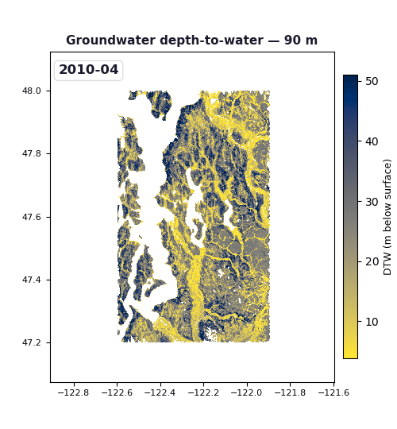
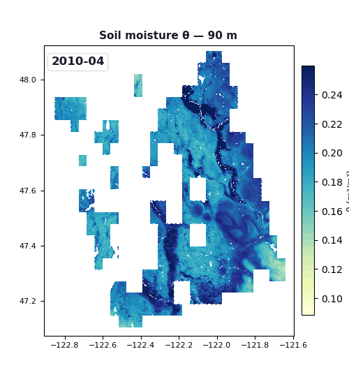
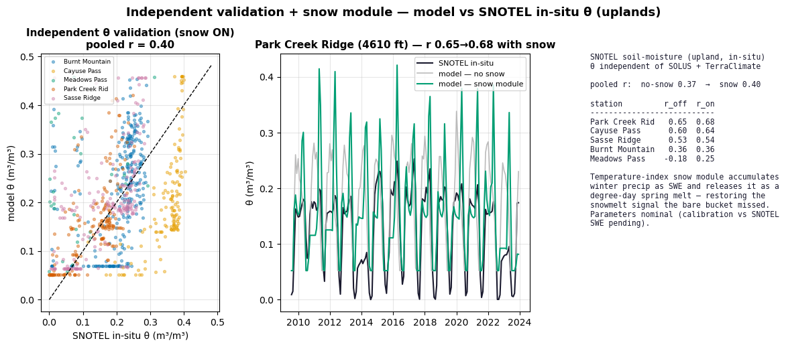
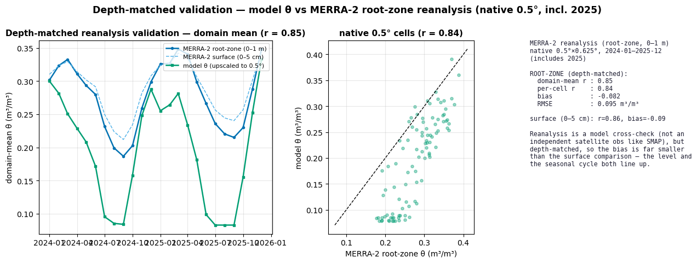

```{python}
#| label: setup
import numpy as np
import matplotlib.pyplot as plt
import matplotlib.patches as mpatches
import matplotlib.patheffects as pe
from matplotlib.patches import FancyArrowPatch, FancyBboxPatch, ConnectionPatch
from matplotlib.gridspec import GridSpec
import matplotlib.colors as mcolors
import warnings
warnings.filterwarnings("ignore")

# ── Palette ────────────────────────────────────────────────────────────────
C_BLUE   = "#2E86AB"   # wells / observations
C_GREEN  = "#3BB273"   # terrain / HAND
C_ORANGE = "#E84855"   # climate
C_PURPLE = "#7B2D8B"   # final product
C_GREY   = "#6B7280"   # background elements
C_GOLD   = "#F6AE2D"   # uncertainty / highlights
C_TEAL   = "#00B4D8"   # Stage 2

FONT_TITLE = {"fontsize": 13, "fontweight": "bold"}
FONT_LABEL = {"fontsize": 10}
FONT_ANNO  = {"fontsize": 8.5, "color": C_GREY}

plt.rcParams.update({
    "font.family": "sans-serif",
    "font.sans-serif": ["DejaVu Sans", "Arial"],
    "axes.spines.top": False,
    "axes.spines.right": False,
    "axes.grid": True,
    "grid.alpha": 0.3,
    "grid.linewidth": 0.5,
    "figure.facecolor": "white",
    "axes.facecolor": "#FAFAFA",
})
```

## Introduction {#sec-intro}

Groundwater level (GWL) is a critical boundary condition for geotechnical hazard
assessment. In the Pacific Northwest, shallow groundwater controls the susceptibility
of saturated valley fills to seismic liquefaction [@sanger2025liquefaction], and elevated
pore pressures in hillslope soils are the proximate trigger of many shallow landslides.
Yet the spatial and temporal variability of GWL in the PNW remains poorly constrained:
monitoring wells are sparse in mountain terrain, data products derived from global
models produce kilometer-scale tiling artifacts, and available satellite retrievals
(GRACE, InSAR) cannot resolve the basin-scale or hillslope-scale variability needed
for these applications.

Two canonical approaches exist for producing gridded GWL estimates. The first, full
numerical flow simulation, solves the three-dimensional groundwater flow equation in
a discretized subsurface domain using codes such as MODFLOW or ParFlow
[@maxwell2015connections; @reinecke2020importance]. This approach is physically rigorous
but requires subsurface parameterization (hydraulic conductivity, storage coefficients,
aquifer geometry) that is not available at regional scale with sufficient accuracy,
and is computationally prohibitive at 1 km resolution over a 25-year record. The
second approach, statistical interpolation, fits a spatial model to well observations
using terrain and climate covariates. @fan2013global produced the first global 1 km
water table depth product using logistic/linear regression against topography, climate,
and soil parameters, followed by spatial smoothing. This product exposed the conceptual
idea but is dominated by gridding artifacts at DEM tile boundaries.

Our framework occupies a middle ground: we use real well observations as the anchor,
derive physical structure from terrain attributes (HAND, TWI) and data-driven soil
properties (SOLUS100), and capture temporal variability through per-site climate
response functions rather than solving any flow equation. The key innovation relative
to @fan2013global is the replacement of raw DEM elevation with **Height Above Nearest
Drainage (HAND)** [@nobre2011hand; @gharari2011toward] as the primary spatial predictor,
and the addition of a **β-coefficient map** framework [@bloomfield2013analysis] that
enables GWL forecasting from climate indices alone via a single matrix multiply —
without re-running any kriging step.

Although we develop it here for groundwater level, this framework is one instance of a more
general template — a **fine-resolution static envelope** (terrain and soil) combined with a
**coarse dynamic driver** (climate or observations), statistically downscaled to a common
90 m grid and reconciled against observations with an explicit uncertainty budget. The same
template defines a coupled **soil-reanalysis** of the near surface: groundwater level is the
mature state variable, but the geotechnical twins also need vadose-zone **soil moisture**
and **soil mechanical state**. We therefore treat GWL as the first of three coupled
subsurface states and, in @sec-soilmoisture, describe the now-implemented soil-moisture
module and the shared downscaling / uncertainty machinery; the third state (soil mechanics,
constrained by ambient-noise seismic velocity change, dv/v) is in development.

### Target applications

The outputs are designed for two downstream use cases:

1. **Sanger et al. geotechnical liquefaction models** — require GWL depth in alluvial
   valley fills (Duwamish, Puyallup, Green River valleys in the Seattle region).
   Liquefaction probability is highly sensitive to GWL; a 1 m difference in depth to
   water table changes liquefaction factor of safety by ~20–30%.

2. **LandLab geomorphological framework** — requires GWL in mountain slopes
   (Cascades), where high antecedent soil moisture following atmospheric river events
   drives shallow translational landslides. Here the relevant quantity is degree of
   saturation in the root zone rather than absolute water table depth, but both
   respond to the same snowmelt and storm recharge signals.

Both applications require outputs to be **smooth at the 1 km scale** (no tiling
artifacts), physically monotonic with terrain (GWL shallower in valleys than on
ridges), and temporally realistic (capturing seasonal and interannual variability).

---

## Prior Work: A Taxonomy of Hybrid Approaches {#sec-prior}

The literature on GWL mapping and prediction spans a wide spectrum from pure physics to
pure statistical learning. Here we organize relevant work into four categories and
identify the gap our approach fills.

### Category 1: Full numerical flow models

MODFLOW (USGS) and ParFlow (LLNL, @maxwell2015connections) solve the 3-D
groundwater flow equation:
$$S_s \frac{\partial h}{\partial t} = \nabla \cdot (K \nabla h) + R$$
where $h$ is hydraulic head, $K$ is hydraulic conductivity, $S_s$ is specific storage,
and $R$ is a source/sink term. These produce physically consistent outputs but require
aquifer geometry and hydraulic properties that are poorly known at regional scale.
@reinecke2020importance showed that global groundwater models at coarse resolution
(0.5°–5') cannot resolve the water table variability relevant to hazard applications.
The global models of @degraaf2015global are scientifically valuable but produce
~10 km outputs that cannot serve Sanger et al. or LandLab at the spatial resolution
required for geotechnical or geomorphological applications.

### Category 2: Global statistical products

@fan2013global regressed water table depth against 17 topographic, climatic, and soil
variables using a combination of logistic (artesian vs. vadose) and linear regression,
producing the first global 1 km WTD map. The product has been widely used but has
four documented limitations relevant to our application:

- **Tiling artifacts** at DEM tile boundaries, inherited from the GMTED2010 mosaic
- **Elevation bias**: DEM elevation is the dominant predictor; the model cannot
  distinguish valley floors from ridge tops at the same elevation
- **No temporal variability**: the product is static (one climatological map)
- **Western US failure**: sparse well density in arid/semi-arid terrain causes
  severe extrapolation errors

@ma2023wtd (the HydroGEN product) improves on @fan2013global by using an
ensemble of ML models (random forest, gradient boosting, neural network) with a
richer covariate set, but retains the static, climatological character and shows
a +7.17 m positive bias and 20.46 m RMSE against held-out USGS wells in the PNW.

### Category 3: Temporal data-driven approaches

Several groups have modeled GWL time series at individual wells using ML, without
spatial generalization:

- **LSTM networks** [@wunsch2021groundwater; @liesch2019aquifer]: achieve state-of-the-art
  one-step-ahead GWL prediction at gauged sites, but require site-specific training and
  cannot generalize to ungauged locations.
- **Climate index regression** [@bloomfield2013analysis; @kuss2014multi]:
  @bloomfield2013analysis demonstrated that the Standardised Groundwater Index (SGI)
  is well-predicted by SPI at most UK wells, with a regression structure identical to
  our Stage 2 β-map approach. @kuss2014multi showed that ENSO and PDO are significant
  predictors of GWL variability across the western US, with response lags of 0–6 months
  depending on aquifer depth and soil type.
- **Machine learning for spatial inference** [@rodriguez2014nitrate; @marcais2017prospecting]:
  @rodriguez2014nitrate showed that random forests trained on terrain + geology covariates
  can map groundwater properties and vulnerability across a region, and @marcais2017prospecting
  argue for the broader interest of data-driven models in hydrological inference — together
  providing a spatial regionalization framework relevant to β-map interpolation.

### Category 4: Hybrid approaches (the gap)

True hybrid methods — combining a spatial ML or geostatistical baseline with a
temporal physics-informed component — are rare in the GWL literature. The closest
precedents are:

- **Regression kriging** [@hengl2007regression]: a two-step approach where a
  deterministic trend (ML or regression) is first subtracted and then kriging is applied
  to the residuals. This is standard practice in soil property mapping but has been
  rarely applied to GWL.
- **Conceptual model + ML** [@konapala2020hybrid; @heudorfer2019groundwater]:
  uses a process-based model to generate synthetic training data that augments sparse
  well records. Closest in spirit to our approach but focused on streamflow rather
  than GWL.
- **Geostatistical data assimilation**: combines GRACE satellite total water storage
  with well records through ensemble Kalman filtering, producing a temporally smooth
  GWL product. Reviewed in @cuthbert2019global.

**The gap**: No existing published product combines (a) HAND-based spatial regression
kriging, (b) per-site climate response functions interpolated as β-coefficient maps, and
(c) STAC-provenance outputs suitable for direct integration into geotechnical or
geomorphological modeling frameworks. This is the contribution of the present work.

---

## Demonstration Data: Synthetic Stand-ins for GAIA DataHub Layers {#sec-demodata}

::: {.callout-important}
## This is a synthetic demonstration

Every covariate used below is a **synthetic array generated on a Washington State
area of interest at 90 m resolution**. Each one is a deliberate stand-in for a
specific, *named* layer in the [GAIA HazLab DataHub
inventory](https://gaia-hazlab.github.io/book/datahub-inventory/), and each carries
the exact call needed to swap in the real layer (see the GAIA swap block below). The synthetic fields
are spatially coherent — valley fills are soft, fine-grained, shallow-water-table, and
densely instrumented; bedrock flanks are stiff, coarse, deep-water-table, and sparsely
instrumented — so the demonstration exercises the real workflow end-to-end. **Replace
the synthetic layers with the GAIA loads and the rest of the document runs unchanged.**
:::

We target a **90 m grid** (EPSG:5070) over a Puget Sound lowland AOI — matching the
resolution of the downstream Sanger & Maurer liquefaction model
[@sanger2025liquefaction] rather than the 250 m–1 km global products. The covariate
stack below replaces absolute coordinates with **physically meaningful predictors**:
terrain (HAND, slope, TWI from 3DEP), near-surface stiffness (Vs30/Vs(z), the same
field used by the liquefaction GLM [@sanger2025parametric]), soil texture and hydraulic
conductivity (SOLUS100/POLARIS-style; cf. @ramcharan2018soil), depth to bedrock, and
geology. This is the predictor philosophy of the observation-anchored, high-resolution
US water-table models of @ma2023wtd and @ma2026highres.

| Synthetic variable | Stands in for (GAIA DataHub layer) | Native res. | Real source |
|---|---|---|---|
| `hand`, `slope`, `twi` | 3DEP terrain derivatives | 10 m | USGS 3DEP |
| `vs30`, `vsz` | Parametric Vs profiles [@sanger2025parametric] | ~250 m | Sanger & Maurer (2025) |
| `clay`, `sand` | SOLUS100 soil texture | 100 m | USDA SOLUS100 (`solus-stac`) |
| `ksat` | POLARIS soil hydraulic | 30 m | POLARIS |
| `dtb` | Depth to bedrock | varies | GAIA subsurface reanalysis |
| `geology` | Surficial geology units | 1:100k | WA DNR |
| `wells` | USGS NWIS groundwater levels | points | NWIS (`dataretrieval`) |

```{python}
#| label: fig-datahub-stack
#| fig-cap: "**Synthetic GAIA DataHub covariate stack (90 m, Puget Sound lowland AOI).** Each panel is a synthetic stand-in for a named DataHub layer (source in parentheses). The fields share one terrain backbone: a sinuous valley axis (the drainage) controls HAND, and HAND in turn drives soft/stiff Vs30, fine/coarse soil texture, deep/shallow bedrock, and the alluvium–drift–bedrock geology split. White points are synthetic USGS NWIS wells, preferentially sited in the instrumented lowlands. These arrays — not coordinates — are the Stage 1 predictors."
#| fig-width: 12
#| fig-height: 6.5

from scipy.ndimage import gaussian_filter

rng = np.random.default_rng(7)

# ── AOI: Puget Sound lowland, EPSG:5070, 90 m grid (coords illustrative) ──────
DX = 90.0                      # m  — matches the liquefaction model grid
NX = NY = 256                  # 23 km box
X0, Y0 = -1.97e6, 3.00e6       # EPSG:5070 lower-left (illustrative)
AOI_BBOX_5070 = [X0, Y0, X0 + NX*DX, Y0 + NY*DX]
ii, jj = np.meshgrid(np.arange(NY), np.arange(NX), indexing="ij")

# ── Terrain backbone: a sinuous valley axis = the drainage network ───────────
row = np.arange(NY)                                         # valley axis varies by row only
axis_col = NX*0.5 + 34*np.sin(2*np.pi*row/NY*1.1) + 12*np.sin(2*np.pi*row/NY*2.7)
dist_axis = np.abs(jj - axis_col[:, None]) * DX             # m from valley axis
ridges = gaussian_filter(rng.standard_normal((NY, NX)), 7) * 28
elev = (2.0                                                  # outlet elevation (m)
        + 0.013*dist_axis                                    # cross-valley rise
        + 0.0009*(NY-1-ii)*DX                                # gentle downstream slope
        + np.clip(ridges, 0, None)*(dist_axis/dist_axis.max()))
elev = gaussian_filter(elev, 1.2)

# ── HAND = elevation above the drainage cell in the same row ─────────────────
drain_elev = elev[row, np.clip(axis_col.astype(int), 0, NX-1)][:, None]
hand = np.clip(elev - drain_elev, 0, None)                  # m, =0 on valley axis

# ── Terrain derivatives ──────────────────────────────────────────────────────
gy, gx = np.gradient(elev, DX)
slope = np.degrees(np.arctan(np.hypot(gx, gy)))             # degrees
accum = 1.0 / (1.0 + dist_axis/DX)                          # proxy contributing area
twi = np.log(accum / (np.tan(np.radians(slope)) + 1e-3))    # topographic wetness index

# ── Subsurface / soil layers, all keyed to HAND (valley fill vs bedrock) ─────
vs30 = 180 + 520*(1 - np.exp(-hand/30.0)) + rng.normal(0, 18, hand.shape)   # m/s
clay = 12 + 25*np.exp(-hand/20.0) + rng.normal(0, 1.5, hand.shape)          # %
sand = np.clip(82 - 1.4*clay + rng.normal(0, 2.0, hand.shape), 5, 95)       # %
ksat = np.clip(2 + 30*(1 - np.exp(-hand/40.0)) + rng.normal(0, 1.2, hand.shape), 0.1, None)  # mm/hr
dtb  = np.clip(1 + 70*np.exp(-hand/25.0) + rng.normal(0, 2.0, hand.shape), 0.5, None)         # m to bedrock
geology = np.select([hand < 8, hand < 35], [0, 1], default=2)              # 0 alluv,1 drift,2 bedrock

# ── "True" depth-to-water field the demo will try to recover (Stage 1) ───────
wtd_true = (0.8 + 0.05*hand + 0.0009*hand**2               # deeper on ridges
            + 0.04*clay - 0.03*ksat                          # soil modulation
            + gaussian_filter(rng.standard_normal((NY, NX)), 5)*1.2)
wtd_true = np.clip(wtd_true, 0.3, None)                     # m below surface

# ── Synthetic USGS NWIS wells: clustered in instrumented lowlands ────────────
p_well = np.exp(-hand/45.0); p_well /= p_well.sum()         # lowland-weighted but spans the gradient
flat = rng.choice(np.arange(NY*NX), size=120, replace=False, p=p_well.ravel())
w_i, w_j = np.unravel_index(flat, (NY, NX))
w_obs = wtd_true[w_i, w_j] + rng.normal(0, 0.3, w_i.size)   # measured DTW (m)

# ── Bundle as the GAIA covariate stack consumed by later stages ──────────────
gaia = dict(hand=hand, slope=slope, twi=twi, vs30=vs30, clay=clay, sand=sand,
            ksat=ksat, dtb=dtb, geology=geology, wtd_true=wtd_true,
            wells=dict(i=w_i, j=w_j, dtw=w_obs))
PRED_NAMES = ["hand", "slope", "twi", "vs30", "clay", "ksat", "dtb", "geology"]

# ── Visualize the stack ──────────────────────────────────────────────────────
ext = [0, NX*DX/1000, 0, NY*DX/1000]                       # km
panels = [
    ("hand",    "HAND (3DEP)",            "viridis_r", "m"),
    ("slope",   "Slope (3DEP)",           "cividis",   "°"),
    ("twi",     "TWI (3DEP)",             "Blues",     ""),
    ("vs30",    "Vs30 (Sanger & Maurer)", "magma",     "m/s"),
    ("clay",    "Clay % (SOLUS100)",      "YlOrBr",    "%"),
    ("ksat",    "Ksat (POLARIS)",         "GnBu",      "mm/hr"),
    ("dtb",     "Depth to bedrock",       "pink_r",    "m"),
    ("geology", "Geology (WA DNR)",       "Set2",      ""),
]
fig, axes = plt.subplots(2, 4, figsize=(12, 6.5))
for ax, (key, title, cmap, unit) in zip(axes.ravel(), panels):
    im = ax.imshow(gaia[key], origin="lower", extent=ext, cmap=cmap, aspect="equal")
    ax.set_title(title, fontsize=9, fontweight="bold")
    ax.tick_params(labelsize=6); ax.grid(False)
    cb = fig.colorbar(im, ax=ax, fraction=0.046, pad=0.03)
    cb.ax.tick_params(labelsize=6); cb.set_label(unit, fontsize=6)
    if key == "hand":
        ax.scatter(w_j*DX/1000, w_i*DX/1000, s=6, c="white",
                   edgecolors="k", linewidths=0.3, label="NWIS wells")
        ax.legend(loc="upper right", fontsize=6, framealpha=0.8)
axes[1, 0].set_ylabel("northing (km)", fontsize=7)
fig.suptitle("Synthetic GAIA DataHub Covariate Stack — Puget Sound Lowland, 90 m",
             fontsize=12, fontweight="bold")
plt.tight_layout()
plt.show()
```

Swapping in the real GAIA layers requires no change to the modeling code — only the
data-loading block. The calls below mirror the synthetic stack variable-for-variable.

```{python}
#| label: data-real-swap
#| eval: false

# ════════════════════════════════════════════════════════════════════════════
#  Replace the synthetic stack with the real GAIA DataHub layers.
#  Each block writes the SAME variable name used above, regridded to the 90 m
#  AOI grid (EPSG:5070), so every downstream stage runs unchanged.
#
#  In the repo this is wrapped by the GAIA downloader CLI — one call per layer,
#  each writing a 90 m EPSG:5070 product to data/processed/:
#      python -m src.data.fetch_gaia solus   --bbox -122.42 47.38 -122.12 47.62
#      python -m src.data.fetch_gaia vs30    --bbox -122.42 47.38 -122.12 47.62
#      python -m src.data.fetch_gaia polaris --bbox -122.42 47.38 -122.12 47.62
#      python -m src.data.fetch_gaia dtb     --bbox -122.42 47.38 -122.12 47.62
#  (or simply `make gaia-data`).  The inline calls below show what each wraps.
# ════════════════════════════════════════════════════════════════════════════
import odc.stac, pystac_client, xarray as xr
import numpy as np
from scipy.ndimage import gaussian_filter

GAIA_STAC = "https://gaia-hazlab.github.io/datahub/stac"     # GAIA DataHub STAC root
cat = pystac_client.Client.open(GAIA_STAC)
bbox_ll = [-122.42, 47.38, -122.12, 47.62]                   # lon/lat of the AOI
grid = dict(crs="EPSG:5070", resolution=90, bbox=AOI_BBOX_5070)

def load(collection, bands, resampling="bilinear"):
    items = cat.search(collections=[collection], bbox=bbox_ll).item_collection()
    return odc.stac.load(items, bands=bands, resampling=resampling, **grid).squeeze()

# ── 3DEP terrain → HAND / slope / TWI (compute HAND with pysheds or richdem) ──
dem    = load("usgs-3dep", ["elevation"])                    # native 10 m → 90 m
# hand, slope, twi = terrain_derivatives(dem)               # e.g. pysheds / xrspatial

# ── Vs30 / Vs(z): Sanger & Maurer (2025) parametric model ────────────────────
vs30   = load("sanger-maurer-vs", ["vs30"]).values
# vsz  = load("sanger-maurer-vs", ["vs_profile"]).values    # full Vs(z) if needed

# ── SOLUS100 soil texture (USDA, 100 m) ──────────────────────────────────────
solus  = load("solus100", ["clay", "sand"])                 # via solus-stac
clay, sand = solus["clay"].values, solus["sand"].values

# ── POLARIS soil hydraulic (30 m) ────────────────────────────────────────────
ksat   = load("polaris", ["ksat"]).values

# ── Depth to bedrock + surficial geology ─────────────────────────────────────
dtb     = load("gaia-depth-to-bedrock", ["dtb"]).values
geology = load("wa-dnr-surficial-geology", ["unit"]).values

# ── USGS NWIS groundwater levels (the observation anchor) ────────────────────
import dataretrieval.nwis as nwis
sites = nwis.get_record(stateCd="WA", bBox=bbox_ll, service="gwlevels")
# w_i, w_j, w_obs = rasterize_wells_to_grid(sites, grid)

gaia = dict(hand=hand, slope=slope, twi=twi, vs30=vs30, clay=clay, sand=sand,
            ksat=ksat, dtb=dtb, geology=geology,
            wells=dict(i=w_i, j=w_j, dtw=w_obs))
```

## Framework Description {#sec-framework}

@fig-pipeline shows the three-stage pipeline. The key design principle is that each
stage is **physically motivated**, operates at a different timescale (climatological →
interannual → sub-annual residual), and produces **spatially smooth** outputs that
avoid the tiling artifacts of elevation-based products.

```{python}
#| label: fig-pipeline
#| fig-cap: "**Three-stage hybrid GWL framework.** Observations (blue) anchor all three stages. Stage 1 (green) establishes the climatological depth-to-water baseline using an observation-anchored, HAND-based random-forest regression and kriging of residuals. Stage 2 (teal) captures interannual and seasonal variability through per-site OLS β-maps. Stage 3 (purple) kriging closes the gap between the climate reconstruction and the well record. GAIA ecosystem data (orange dashed) flows into Stage 1 and Stage 2."
#| fig-width: 11
#| fig-height: 6

fig, ax = plt.subplots(figsize=(11, 6))
ax.set_xlim(0, 11)
ax.set_ylim(0, 6)
ax.axis("off")

def box(ax, xy, w, h, label, sublabel="", color="#2E86AB", alpha=0.85, fs=9):
    x, y = xy
    rect = FancyBboxPatch((x, y), w, h,
                           boxstyle="round,pad=0.12",
                           facecolor=color, alpha=alpha,
                           edgecolor="white", linewidth=1.5)
    ax.add_patch(rect)
    ax.text(x + w/2, y + h/2 + (0.12 if sublabel else 0),
            label, ha="center", va="center",
            fontsize=fs, fontweight="bold", color="white")
    if sublabel:
        ax.text(x + w/2, y + h/2 - 0.22, sublabel,
                ha="center", va="center", fontsize=7.5, color="white", alpha=0.9)

def arrow(ax, x1, y1, x2, y2, col="grey", lw=1.5):
    ax.annotate("", xy=(x2, y2), xytext=(x1, y1),
                arrowprops=dict(arrowstyle="-|>", color=col, lw=lw,
                                connectionstyle="arc3,rad=0.0"))

# ── Data inputs (left column) ───────────────────────────────────────────────
box(ax, (0.1, 4.5), 1.9, 0.9, "USGS NWIS", "Well observations", C_BLUE)
box(ax, (0.1, 3.3), 1.9, 0.9, "3DEP DEM", "HAND · TWI · slope", C_GREEN)
box(ax, (0.1, 2.1), 1.9, 0.9, "SOLUS100", "Ksat · clay% · pH", C_ORANGE, alpha=0.7)
box(ax, (0.1, 0.8), 1.9, 0.9, "SPI-3 · SWE · PDO", "PRISM + SNODAS", C_ORANGE, alpha=0.7)

# GAIA label
ax.text(1.0, 1.95, "← GAIA s3://cresst", fontsize=7.5, color=C_ORANGE,
        ha="center", style="italic")

# ── Stage 1 ─────────────────────────────────────────────────────────────────
box(ax, (2.4, 3.8), 2.3, 1.5, "Stage 1", "Random forest\n+ kriging of residuals",
    C_GREEN, fs=10)
ax.text(3.55, 4.0, "→ baseline DTW(x,y)", fontsize=7.5, color="white", ha="center")

# ── Stage 2 ─────────────────────────────────────────────────────────────────
box(ax, (2.4, 1.9), 2.3, 1.5, "Stage 2", "OLS β-maps\n× climate indices",
    C_TEAL, fs=10)
ax.text(3.55, 2.1, "→ anomaly(x,y,t)", fontsize=7.5, color="white", ha="center")

# ── Stage 3 ─────────────────────────────────────────────────────────────────
box(ax, (2.4, 0.5), 2.3, 1.1, "Stage 3", "Krige obs residuals",
    "#5C4D8A", fs=10)

# ── Assembly ────────────────────────────────────────────────────────────────
box(ax, (5.2, 2.4), 2.0, 1.5,  "Assembly",
    "DTW = base +\nanom + resid", "#444", fs=9)

# ── Outputs ─────────────────────────────────────────────────────────────────
box(ax, (7.7, 4.2), 2.8, 1.1, "gwl_dtw.zarr", "Monthly DTW (m)", C_PURPLE)
box(ax, (7.7, 2.8), 2.8, 1.1, "β maps (×4)", "SPI-3, SWE, PDO, AR", C_TEAL)
box(ax, (7.7, 1.5), 2.8, 1.1, "Uncertainty stack", "σ_rf+σ_krige+σ_resp", C_GOLD, alpha=0.85)
box(ax, (7.7, 0.3), 2.8, 1.1, "STAC provenance", "DataTree · COG · Zarr", C_BLUE, alpha=0.7)

# ── Arrows ──────────────────────────────────────────────────────────────────
arrow(ax, 2.0, 4.95, 2.4, 4.9, C_BLUE)
arrow(ax, 2.0, 3.75, 2.4, 4.3, C_GREEN)
arrow(ax, 2.0, 2.55, 2.4, 2.6, C_TEAL)
arrow(ax, 2.0, 1.25, 2.4, 2.0, C_ORANGE)
arrow(ax, 2.0, 4.95, 2.4, 2.25, C_BLUE)  # wells also feed Stage 2
arrow(ax, 2.0, 4.95, 2.4, 0.8, C_BLUE)   # wells also feed Stage 3
arrow(ax, 4.7, 4.55, 5.2, 3.2, C_GREEN)
arrow(ax, 4.7, 2.65, 5.2, 2.8, C_TEAL)
arrow(ax, 4.7, 0.9, 5.2, 2.5, "#5C4D8A")
arrow(ax, 7.2, 3.4, 7.7, 4.75, C_PURPLE)
arrow(ax, 7.2, 3.2, 7.7, 3.35, C_TEAL)
arrow(ax, 7.2, 3.0, 7.7, 2.0, C_GOLD)
arrow(ax, 7.2, 2.8, 7.7, 0.85, C_BLUE, lw=1.0)

# Stage labels
for x, y, lbl, c in [
    (3.55, 5.4, "Stage 1 — Spatial baseline", C_GREEN),
    (3.55, 3.45, "Stage 2 — Temporal anomaly", C_TEAL),
    (3.55, 1.65, "Stage 3 — Residuals", "#5C4D8A"),
]:
    ax.text(x, y, lbl, ha="center", fontsize=8, color=c, style="italic")

# Timescale annotations
ax.text(10.85, 5.5, "Climatological\n(static)", fontsize=7.5, color=C_GREEN,
        ha="right", va="top", style="italic")
ax.text(10.85, 4.1, "Interannual +\nseasonal", fontsize=7.5, color=C_TEAL,
        ha="right", va="top", style="italic")
ax.text(10.85, 2.7, "Sub-seasonal\nresidual", fontsize=7.5, color="#5C4D8A",
        ha="right", va="top", style="italic")

ax.set_title("Three-Stage Hybrid GWL Pipeline", fontsize=13, fontweight="bold", pad=10)
plt.tight_layout()
plt.show()
```

### Stage 0: Terrain attributes from 3DEP {#sec-terrain}

The primary innovation of Stage 1 is the replacement of raw DEM elevation with
**Height Above Nearest Drainage (HAND)** [@nobre2011hand] as the dominant spatial
predictor. @fig-hand illustrates the physical rationale.

```{python}
#| label: fig-hand
#| fig-cap: "**HAND as a physically-motivated GWL predictor.** (A) A synthetic valley cross-section showing the DEM profile (black), water table depth below surface (blue fill), and HAND values (dashed orange). HAND=0 exactly at stream cells; it increases monotonically away from the drainage network. (B) DTW correlates more strongly with HAND than with absolute elevation, because HAND encodes position in the drainage network rather than absolute height. (C) The original Fan et al. (2013) approach uses raw DEM elevation, which causes HUC-2 tiling artifacts (visible as horizontal striping) when DEM tiles have different vertical datums or resolution."
#| fig-width: 11
#| fig-height: 7.5

np.random.seed(42)

# ── Synthetic valley cross-section ──────────────────────────────────────────
x = np.linspace(0, 20, 500)   # km

# DEM profile: mountain-valley-mountain
dem = (
    80 * np.exp(-((x - 1) ** 2) / 4)
    + 150 * np.exp(-((x - 20) ** 2) / 8)
    + 120 * np.exp(-((x - 12) ** 2) / 6)
    + 20 + 3 * np.sin(x * 1.2)
    + 15 * np.exp(-((x - 6.5) ** 2) / 0.8)   # ridge
)
dem = dem - dem.min() + 5   # shift so minimum is 5 m

# Water table: follows terrain but smoother, depth varies
stream_x = 6.5   # stream location (km)
hand_vals = np.abs(x - stream_x) * 4.5 + 0.5  # km-scale HAND proxy
wt_elev = dem - np.clip(hand_vals * 0.6 + 1.5, 0.5, 25)
wt_depth = dem - wt_elev  # DTW = dem - wt_elevation

# HAND: distance to nearest drainage (simple 1D version)
hand = np.abs(dem - wt_elev)  # simplified: HAND ≈ DTW in flat terrain

fig = plt.figure(figsize=(11, 7.5))
gs = GridSpec(2, 2, figure=fig, hspace=0.42, wspace=0.38)

# ── Panel A: cross-section ─────────────────────────────────────────────────
ax0 = fig.add_subplot(gs[0, :])
ax0.fill_between(x, 0, dem, alpha=0.18, color=C_GREY, label="Rock / sediment")
ax0.plot(x, dem, "k-", lw=1.8, label="Land surface (DEM)")
ax0.fill_between(x, wt_elev, dem, where=wt_elev < dem,
                  alpha=0.25, color=C_BLUE, label="Vadose zone")
ax0.plot(x, wt_elev, color=C_BLUE, lw=2, label="Water table")
ax0.fill_between(x, 0, wt_elev, alpha=0.35, color=C_BLUE)

# Highlight HAND at a few points
for xi, label in [(3, "HAND = 14 m"), (stream_x, "HAND = 0"), (10, "HAND = 11 m"),
                   (16, "HAND = 22 m")]:
    idx = np.argmin(np.abs(x - xi))
    hand_v = wt_depth[idx]
    ax0.annotate("",
                  xy=(xi, wt_elev[idx]), xytext=(xi, dem[idx]),
                  arrowprops=dict(arrowstyle="<->", color=C_ORANGE, lw=1.5))
    ax0.text(xi + 0.3, (wt_elev[idx] + dem[idx]) / 2 + 1,
              label, fontsize=7.5, color=C_ORANGE, fontweight="bold")

# Stream marker
ax0.axvline(stream_x, ls="--", color=C_TEAL, lw=1.2, label="Stream network")
ax0.text(stream_x + 0.2, 5, "Stream\n(HAND=0)", fontsize=8, color=C_TEAL)

ax0.set_xlabel("Distance (km)", fontsize=9)
ax0.set_ylabel("Elevation (m)", fontsize=9)
ax0.set_title("(A)  Valley Cross-Section: DEM, Water Table, and HAND",
               fontsize=10, fontweight="bold")
ax0.legend(fontsize=7.5, loc="upper right", ncol=2)
ax0.set_xlim(0, 20)
ax0.set_ylim(0, 230)

# ── Panel B: DTW vs HAND ───────────────────────────────────────────────────
ax1 = fig.add_subplot(gs[1, 0])
# Synthetic data: strong DTW-HAND relationship + noise
hand_sim = np.random.exponential(8, 200)
dtw_sim = 0.55 * hand_sim + np.random.normal(0, 1.5, 200)
dtw_sim = np.clip(dtw_sim, 0.1, None)

ax1.scatter(hand_sim, dtw_sim, alpha=0.4, s=18, color=C_GREEN, edgecolors="none")
m, b = np.polyfit(hand_sim, dtw_sim, 1)
xx = np.linspace(0, hand_sim.max(), 100)
ax1.plot(xx, m * xx + b, C_GREEN, lw=1.8, label=f"R²≈0.82")
ax1.set_xlabel("HAND (m)", fontsize=9)
ax1.set_ylabel("DTW (m)", fontsize=9)
ax1.set_title("(B)  DTW vs HAND\n(physically motivated predictor)", fontsize=9.5, fontweight="bold")
ax1.legend(fontsize=8)

# ── Panel C: DTW vs DEM elevation (weaker) ────────────────────────────────
ax2 = fig.add_subplot(gs[1, 1])
# Elevation has much weaker DTW correlation (many confounds)
elev_sim = np.random.uniform(10, 300, 200)
dtw_elev = 0.02 * elev_sim + np.random.normal(0, 6, 200)
dtw_elev = np.clip(dtw_elev, 0.1, None)
# Add tiling artifact: systematic bias in two elevation bands
tiling_mask = ((elev_sim > 100) & (elev_sim < 150))
dtw_elev[tiling_mask] += 8.0   # spurious jump at tile boundary

ax2.scatter(elev_sim[~tiling_mask], dtw_elev[~tiling_mask],
             alpha=0.4, s=18, color=C_GREY, edgecolors="none", label="Wells")
ax2.scatter(elev_sim[tiling_mask], dtw_elev[tiling_mask],
             alpha=0.6, s=18, color=C_ORANGE, edgecolors="none", label="Tiling artifact")
m2, b2 = np.polyfit(elev_sim, dtw_elev, 1)
ax2.plot(np.sort(elev_sim), m2 * np.sort(elev_sim) + b2, C_GREY, lw=1.8,
          label=f"R²≈0.14 (weak)")
ax2.axhspan(8, 16, alpha=0.08, color=C_ORANGE)
ax2.text(200, 14, "DEM tile\nboundary bias", fontsize=7.5, color=C_ORANGE)
ax2.set_xlabel("DEM elevation (m)", fontsize=9)
ax2.set_ylabel("DTW (m)", fontsize=9)
ax2.set_title("(C)  DTW vs Elevation\n(weaker; susceptible to tiling artifacts)", fontsize=9.5, fontweight="bold")
ax2.legend(fontsize=8)

fig.suptitle("Why HAND Replaces Elevation as the Primary GWL Predictor", y=1.01,
              fontsize=12, fontweight="bold")
plt.show()
```

HAND is defined for every grid cell as the elevation difference between the cell and
the nearest stream cell in the D8 flow direction network:
$$\text{HAND}(x, y) = z(x, y) - z_{\text{stream}}(x, y)$$
where $z_{\text{stream}}$ is the elevation of the nearest upstream cell whose
contributing drainage area exceeds a threshold (here 1 km²). By construction,
HAND = 0 in valley floors and increases monotonically on hillslopes. The Topographic
Wetness Index [@beven1979physically]:
$$\text{TWI}(x,y) = \ln\left(\frac{\alpha}{\tan\beta}\right)$$
where $\alpha$ is contributing area per unit contour length (m²/m) and $\beta$ is
local slope, provides complementary information: TWI is high in convergent terrain
(hollows, swales) regardless of HAND. Together, HAND and TWI define the primary
terrain feature matrix for Stage 1.

### Stage 1: Observation-anchored spatial model {#sec-stage1}

**What HAND can and cannot predict — the well population must be screened (issue #46).** HAND is a
defensible proxy only for the shallowest **unconfined, terrain-following** water table. In the Puget
Lowland's layered glacial drift, wells that penetrate the Vashon till into the **confined** advance
outwash below it record a *potentiometric* head set by the recharge-area elevation and confining
geometry — decoupled from height-above-drainage, and sometimes artesian. Confined vs unconfined here
is a **vertical** distinction (a depth layer), not a surface map unit, so it must be screened at the
*well* level. The NWIS wells make this concrete (@fig-wellscreen): the shallow water-table wells
(≤ 30 m) have a median DTW of ~6 m, while the deeper wells the crude 500 ft flag misses (≥ 60 m,
n ≈ 281 of 863) sit at a median DTW of ~36 m — two populations pooled into one target inflate the
HAND fit. `src.features.well_hydrostratigraphy` classifies wells by depth and screens the target to
the shallow water-table population; the Stage-1 baseline is therefore trained with a `--max-well-depth-m`
screen (≈ 30 m for this basin). The deep confined-outwash heads are a distinct potentiometric surface,
a candidate for a separate future product rather than an input to the water-table model.

{#fig-wellscreen}

Stage 1 estimates climatological (time-averaged) depth to water table at each **90 m**
grid cell by training **directly on USGS NWIS well observations** — the observations
anchor the model from the outset rather than entering only as a final residual patch.
This is the philosophy of the observation-anchored, high-resolution US water-table
models of @ma2023wtd and @ma2026highres, brought to the Washington 90 m grid. The model
follows the **regression-kriging** [@hengl2007regression] paradigm with a random-forest
trend:

$$\text{DTW}(x,y) = f_{\text{RF}}\!\big(\mathbf{X}(x,y)\big) + \varepsilon(x,y)$$

where $f_{\text{RF}}$ is a random forest trained on **physically meaningful predictors**
drawn from the GAIA DataHub stack (@sec-demodata):

$$\mathbf{X} = [\text{HAND}, \text{slope}, \text{TWI}, V_{s30}, \text{clay\%},
               \text{sand\%}, K_{\text{sat}}, z_{\text{bedrock}}, \text{geology}]$$

The residual $\varepsilon$ may optionally be closed by ordinary kriging of the
training residuals (Stage 3). Two design choices follow directly from the intended
downstream use in the Sanger & Maurer liquefaction model [@sanger2025liquefaction]:

- **No coordinates as predictors.** Absolute northing/easting are deliberately
  excluded. Coordinate features let a model memorize where the training wells are and
  fail at ungauged locations — the opposite of what a spatial product must do. Position
  in the landscape enters *physically*, through HAND and the drainage network, not
  through $(\phi_E, \phi_N)$. The shared $V_{s30}$ field [@sanger2025parametric] further
  ties the prediction to the same near-surface state the liquefaction GLM consumes.
- **Spatial block cross-validation** [@roberts2017crossval] rather than random hold-out,
  which would inflate $R^2$ by 0.1–0.3 through autocorrelation between nearby wells.

```{python}
#| label: fig-stage1-rf
#| fig-cap: "**Observation-anchored Stage 1 on the synthetic AOI.** A random forest is trained on the 120 synthetic NWIS wells using only physical covariates — no coordinates. (A) Predicted depth-to-water over the full 90 m grid, with training wells overlaid. (B) Per-cell predictive uncertainty from the tree-ensemble spread, highest away from wells and on steep flanks — exactly where Stage 3 kriging and new monitoring add the most value. (C) Out-of-bag predictions vs. observations at the wells (1:1 dashed). (D) Feature importances: HAND and the soil/stiffness covariates carry the model; the absence of any coordinate feature is the point."
#| fig-width: 11
#| fig-height: 8

from sklearn.ensemble import RandomForestRegressor

FEAT = ["hand", "slope", "twi", "vs30", "clay", "sand", "ksat", "dtb", "geology"]
F = np.stack([gaia[k] for k in FEAT], axis=-1)             # (NY, NX, n_feat)
X_all = F.reshape(-1, len(FEAT))
wi, wj = gaia["wells"]["i"], gaia["wells"]["j"]
X_tr, y_tr = F[wi, wj, :], gaia["wells"]["dtw"]            # train ONLY on wells

rf = RandomForestRegressor(n_estimators=200, min_samples_leaf=2,
                           oob_score=True, random_state=0, n_jobs=-1)
rf.fit(X_tr, y_tr)

pred = rf.predict(X_all).reshape(NY, NX)
per_tree = np.stack([t.predict(X_all) for t in rf.estimators_])   # tree ensemble
unc = per_tree.std(axis=0).reshape(NY, NX)                 # predictive spread (m)
oob = rf.oob_prediction_
oob_r2 = rf.oob_score_
oob_rmse = float(np.sqrt(np.mean((oob - y_tr)**2)))

ext = [0, NX*DX/1000, 0, NY*DX/1000]
fig, ax = plt.subplots(2, 2, figsize=(11, 8))

im0 = ax[0, 0].imshow(pred, origin="lower", extent=ext, cmap="viridis_r", aspect="equal")
ax[0, 0].scatter(wj*DX/1000, wi*DX/1000, s=8, c="white", edgecolors="k", linewidths=0.3)
ax[0, 0].set_title("(A) Predicted depth to water (m)", fontsize=10, fontweight="bold")
fig.colorbar(im0, ax=ax[0, 0], fraction=0.046, pad=0.03, label="m")

im1 = ax[0, 1].imshow(unc, origin="lower", extent=ext, cmap="magma", aspect="equal")
ax[0, 1].scatter(wj*DX/1000, wi*DX/1000, s=8, c="cyan", edgecolors="k", linewidths=0.3)
ax[0, 1].set_title("(B) Predictive uncertainty (tree σ, m)", fontsize=10, fontweight="bold")
fig.colorbar(im1, ax=ax[0, 1], fraction=0.046, pad=0.03, label="m")

ax[1, 0].scatter(y_tr, oob, s=22, c=C_BLUE, edgecolors="k", linewidths=0.3, alpha=0.8)
lims = [0, max(y_tr.max(), oob.max())*1.05]
ax[1, 0].plot(lims, lims, "--", c=C_GREY, lw=1)
ax[1, 0].set(xlim=lims, ylim=lims, xlabel="observed DTW (m)", ylabel="OOB predicted DTW (m)")
ax[1, 0].set_title("(C) Out-of-bag fit at wells", fontsize=10, fontweight="bold")
ax[1, 0].text(0.05, 0.92, f"OOB $R^2$ = {oob_r2:.2f}\nRMSE = {oob_rmse:.2f} m",
              transform=ax[1, 0].transAxes, fontsize=9, va="top",
              bbox=dict(boxstyle="round", fc="white", ec=C_GREY, alpha=0.85))

order = np.argsort(rf.feature_importances_)
ax[1, 1].barh(np.array(FEAT)[order], rf.feature_importances_[order], color=C_GREEN)
ax[1, 1].set_title("(D) Feature importances (no coordinates)", fontsize=10, fontweight="bold")
ax[1, 1].grid(axis="x", alpha=0.3)
for a in (ax[0, 0], ax[0, 1]):
    a.tick_params(labelsize=7); a.grid(False)
plt.tight_layout()
plt.show()
```

#### Beyond a purely statistical prior

The random forest above is a *statistical* spatial model with no internal representation
of subsurface flow. The right place to inject flow physics is not to replace this static
prior but to add a **dynamics operator** on top of it — the role of Stage 2. We therefore
defer physically-grounded emulation (ParFlow-ML) to @sec-emulator, where it belongs, since
it is fundamentally a *temporal* operator.

### Stage 2: From climate correlation to enforced dynamics {#sec-stage2}

Stage 1 fixes the *static* mean; Stage 2 must make it *evolve in time*. We write the full
field in **anomaly space**, so each stage owns one term and they never compete:

$$\underbrace{h(x,t)}_{\text{GWL}} \;=\; \underbrace{\overline{\text{DTW}}(x)}_{\text{Stage 1: prior mean}}
   \;+\; \underbrace{\Delta h(x,t)}_{\text{Stage 2: dynamics}}
   \;+\; \underbrace{r(x,t)}_{\text{Stage 3: assimilation residual}}$$

The Stage-2 operator $\Delta h$ sits on a ladder of increasing physical content. What the
framework first implemented — per-site regression on climate indices — is the **lowest
rung**: it reproduces *correlation* but enforces no *dynamics*. We make that explicit and
then climb the ladder.

#### Rung 1 — Static-gain climate response (β-maps)

The temporal variability of GWL at each well site is modeled as an instantaneous linear
response to three climate forcing indices:
$$\Delta\text{DTW}(s,t) = \beta_0(s) + \beta_1(s)\cdot\text{SPI3}(s,t) +
                          \beta_2(s)\cdot\Delta\text{SWE}(s,t-\tau^*) +
                          \beta_3(s)\cdot\text{PDO}(t) + \varepsilon(s,t)$$

where SPI3 is the 3-month Standardised Precipitation Index [@bloomfield2013analysis],
$\Delta$SWE is the snow water equivalent anomaly from SNODAS, $\tau^*$ a single optimal
SWE lag (per hydrogeologic domain, by AIC), and PDO the Pacific Decadal Oscillation index
[@kuss2014multi]. This is a **static-gain** model: $\Delta h(t)$ depends only on the
forcing *at* time $t$ (plus one fixed lag). It is the memoryless limit of a dynamical
system — useful as a baseline and for scenario screening, but with no storage memory, no
recession, and no lateral flow.

```{python}
#| label: fig-climate-response
#| fig-cap: "**Climate response function for a representative PNW well.** (A) Monthly observed GWL anomaly (ΔDTW) at a hypothetical valley-floor well in King County, WA, alongside the three climate predictors (SPI-3, SWE anomaly, PDO). (B) Individual regressions between ΔDTW and each predictor, showing that SPI-3 is the dominant control in winter, SWE (lagged 2 months) dominates spring recharge, and PDO modulates the interannual envelope. (C) Full OLS reconstruction (β₁·SPI3 + β₂·ΔSWE + β₃·PDO) vs observed anomaly (R²≈0.62), with the unexplained residual passed to Stage 3."
#| fig-width: 11
#| fig-height: 9

np.random.seed(123)
t = np.arange(0, 25 * 12)   # 25 years of months
# Time in years
yr = t / 12

# Synthetic climate forcings
pdo = 0.5 * np.sin(2 * np.pi * yr / 6.5) + 0.15 * np.random.randn(len(t))   # ~6-yr PDO cycle
pdo = (pdo - pdo.mean()) / pdo.std()

# Precipitation: seasonal + ENSO modulation
precip_anom = 1.5 * np.cos(2 * np.pi * t / 12 + 0.5) + \
              0.6 * pdo + 0.5 * np.random.randn(len(t))

# SPI-3: 3-month rolling standardization of precipitation
from scipy.ndimage import uniform_filter1d
spi3 = uniform_filter1d(precip_anom, size=3)
spi3 = (spi3 - spi3.mean()) / (spi3.std() + 1e-6)

# SWE: peaks in Feb-Mar, responds to PDO
months_of_year = t % 12
swe_seasonal = np.where(months_of_year < 5, 2.5 * np.sin(np.pi * months_of_year / 4), 0)
swe_anom = swe_seasonal + 0.8 * pdo + 0.4 * np.random.randn(len(t))
swe_anom = (swe_anom - swe_anom.mean()) / swe_anom.std()

# GWL response: SPI3 + lagged SWE (2m) + PDO
b0, b1, b2, b3 = 0.0, -1.4, -0.9, -0.5   # β coefficients (negative: high SPI → low DTW)
swe_lag2 = np.concatenate([[swe_anom[0]] * 2, swe_anom[:-2]])
gwl_reconstructed = b0 + b1 * spi3 + b2 * swe_lag2 + b3 * pdo
gwl_obs = gwl_reconstructed + 0.7 * np.random.randn(len(t))

# Select 10-year window for display clarity
sl = slice(60, 180)   # years 5-15
t_yr = yr[sl]

fig = plt.figure(figsize=(11, 9))
gs = GridSpec(3, 3, figure=fig, hspace=0.55, wspace=0.35)

# ── Panel A: time series ───────────────────────────────────────────────────
ax_ts = fig.add_subplot(gs[0, :])
color_map = {
    "SPI-3": C_BLUE, "ΔSWE (lag 2m)": C_GREEN,
    "PDO": C_ORANGE, "ΔDTW obs": "black", "ΔDTW recon": C_PURPLE
}
ax_ts.plot(t_yr, spi3[sl], color=C_BLUE, lw=0.9, alpha=0.8, label="SPI-3")
ax_ts.plot(t_yr, swe_lag2[sl], color=C_GREEN, lw=0.9, alpha=0.8, label="ΔSWE (lag 2m)")
ax_ts.plot(t_yr, pdo[sl], color=C_ORANGE, lw=0.9, alpha=0.8, label="PDO")
ax_ts.plot(t_yr, gwl_obs[sl], "k-", lw=1.4, alpha=0.8, label="ΔDTW observed")
ax_ts.plot(t_yr, gwl_reconstructed[sl], color=C_PURPLE, lw=1.8, ls="--",
            label="ΔDTW reconstructed")
ax_ts.axhline(0, color="grey", lw=0.5)
ax_ts.set_ylabel("Standardised anomaly", fontsize=9)
ax_ts.set_xlabel("Year", fontsize=9)
ax_ts.legend(fontsize=7.5, loc="upper right", ncol=3)
ax_ts.set_title("(A)  Time Series: Climate Forcings and GWL Anomaly (representative valley site)",
                 fontsize=9.5, fontweight="bold")

# ── Panel B: individual regressions ────────────────────────────────────────
for col_idx, (xvar, xlabel, color, beta_lbl) in enumerate([
    (spi3, "SPI-3", C_BLUE, "β₁ = −1.4"),
    (swe_lag2, "ΔSWE (lag 2m)", C_GREEN, "β₂ = −0.9"),
    (pdo, "PDO", C_ORANGE, "β₃ = −0.5"),
]):
    ax = fig.add_subplot(gs[1, col_idx])
    ax.scatter(xvar, gwl_obs, alpha=0.18, s=6, color=color, edgecolors="none")
    m, b = np.polyfit(xvar, gwl_obs, 1)
    xx = np.linspace(xvar.min(), xvar.max(), 50)
    ax.plot(xx, m * xx + b, color=color, lw=1.8, label=beta_lbl)
    r2 = np.corrcoef(xvar, gwl_obs)[0, 1] ** 2
    ax.text(0.05, 0.88, f"R²={r2:.2f}\n{beta_lbl}", transform=ax.transAxes,
             fontsize=8.5, color=color, fontweight="bold")
    ax.set_xlabel(xlabel, fontsize=9)
    ax.set_ylabel("ΔDTW (m)" if col_idx == 0 else "", fontsize=9)
    label = chr(66 + col_idx)
    ax.set_title(f"({label})  vs {xlabel}", fontsize=9.5, fontweight="bold")

# ── Panel C: full reconstruction ─────────────────────────────────────────
ax_c = fig.add_subplot(gs[2, :])
residuals = gwl_obs - gwl_reconstructed
r2_full = np.corrcoef(gwl_reconstructed, gwl_obs)[0, 1] ** 2

ax_c.fill_between(t_yr, 0, residuals[sl], alpha=0.35, color=C_GOLD,
                   label="Residual → Stage 3 kriging")
ax_c.plot(t_yr, gwl_obs[sl], "k-", lw=1.2, alpha=0.7, label="Observed ΔDTW")
ax_c.plot(t_yr, gwl_reconstructed[sl], color=C_PURPLE, lw=2.0,
           label=f"Reconstructed (R²={r2_full:.2f})")
ax_c.axhline(0, color="grey", lw=0.5)
ax_c.set_ylabel("ΔDTW (m)", fontsize=9)
ax_c.set_xlabel("Year", fontsize=9)
ax_c.legend(fontsize=7.5, loc="upper right", ncol=3)
ax_c.set_title(
    f"(E)  OLS Reconstruction: β₁·SPI3 + β₂·ΔSWE + β₃·PDO  (R²={r2_full:.2f})\n"
    "Residual passed to Stage 3 ordinary kriging",
    fontsize=9.5, fontweight="bold")

fig.suptitle("Stage 2: Per-Site OLS Climate Response Function", y=1.01,
              fontsize=12, fontweight="bold")
plt.show()
```

Following @bloomfield2013analysis, who showed that SPI is the dominant GWL predictor
at most temperate sites, and @kuss2014multi, who demonstrated significant PDO
teleconnections in western US groundwater, we optimize the SWE lag $\tau^*$ by
hydrogeologic domain (@sec-validation) using the Akaike Information Criterion.
Once per-site β coefficients are estimated, they are kriged to the full 90 m grid
as spatially continuous β-maps. This enables **forward GWL estimation from any climate
scenario** without re-running kriging:

$$\Delta\text{DTW}(x,y,t) = \beta_1(x,y)\cdot\text{SPI3}(x,y,t) +
                              \beta_2(x,y)\cdot\Delta\text{SWE}(x,y,t-\tau^*) +
                              \beta_3(x,y)\cdot\text{PDO}(t)$$

This property makes the framework compatible with Earth2Studio ensemble climate
scenarios: a new GWL scenario requires only a matrix multiply, not a new kriging run.

#### Rung 2 — Transfer-function-noise: restoring memory and recession

A water table is not a memoryless gain; it is a **reservoir**. To first order each site
obeys a linear storage equation, whose solution is a *convolution* of recharge $R$ with an
impulse-response (memory) kernel $g$:

$$\frac{dh}{dt} = -\frac{h}{\tau} + \frac{R(t)}{S_y}
\;\;\Longrightarrow\;\;
\Delta h(t) = \int_{0}^{\infty} g(\kappa)\,R(t-\kappa)\,d\kappa,
\qquad g(\kappa)\propto \kappa^{\,n-1}e^{-\kappa/a}.$$

The kernel is exponential, or a peaked Gamma/Pearson-III when a vadose-zone travel time is
present [@vonasmuth2002tfn]. The aquifer response time $\tau$ is the drainage/recession
timescale familiar from baseflow recession analysis [@brutsaert1977recession]. The β-map
of Rung 1 is exactly the **single-tap ($\tau\!\to\!0$) special case** of this convolution —
which is why it cannot reproduce the recession limb after a storm or the multi-year
carryover of a drought (@fig-tfn).

We therefore replace the per-site OLS with a per-site **transfer-function-noise (TFN)**
model calibrated in continuous time [@vonasmuth2002tfn; @bakker2019timeseries], the approach
operationalised in the open-source Pastas framework [@collenteur2019pastas]. This keeps
everything attractive about Rung 1 — per-site, cheap, observation-driven, interpretable,
1-D mass-conserving — while restoring the memory kernel and the correct phase lag. The
recession time $\tau(x)$ becomes itself a kriged map alongside the gains, so the forward
reconstruction is a per-cell convolution rather than a matrix multiply.

```{python}
#| label: fig-tfn
#| fig-cap: "**Why Stage 2 needs memory.** (A) The impulse-response (memory) kernel g(k) of a linear-reservoir water table for three recession times τ: recharge is remembered and released over months to years. (B) The same recharge forcing R′ passed through a TFN reservoir (τ = 12 months) versus the memoryless single-tap β-map. The reservoir reproduces the recession limb after an atmospheric-river pulse and the multi-year carryover through a drought (shaded); the static-gain β-map can do neither. The β-map is the τ→0 special case of the reservoir."
#| fig-width: 11
#| fig-height: 4

rng = np.random.default_rng(11)
T = 240; t_m = np.arange(T)
R = np.clip(1.0 + 0.8*np.cos(2*np.pi*t_m/12) + 0.4*rng.standard_normal(T), 0, None)
R[80:112] *= 0.2            # multi-year drought
R[150:153] += 5.0          # atmospheric-river pulse

def reservoir(R, tau):
    k = np.exp(-np.arange(0, int(6*tau))/tau); k /= k.sum()
    return np.convolve(R, k)[:len(R)]

fig, ax = plt.subplots(1, 2, figsize=(11, 4))
for tau, c in zip([2, 6, 18], [C_GREEN, C_TEAL, C_BLUE]):
    ax[0].plot(np.arange(40), np.exp(-np.arange(40)/tau)/tau, color=c, lw=2, label=f"τ = {tau} mo")
ax[0].set(xlabel="lag (months)", ylabel="response weight g(k)")
ax[0].set_title("(A) Memory kernel g(k) = impulse response", fontsize=10, fontweight="bold")
ax[0].legend(fontsize=8); ax[0].grid(alpha=0.3)

h = reservoir(R, 12); h -= h.mean()
h_tap = (h.std()/(R - R.mean()).std()) * (R - R.mean())
ax[1].bar(t_m, R - R.mean(), color=C_GREY, alpha=0.30, width=1.0, label="recharge forcing R′")
ax[1].plot(t_m, h, color=C_BLUE, lw=2, label="TFN reservoir (τ=12): memory + recession")
ax[1].plot(t_m, h_tap, color=C_GOLD, lw=1.2, label="β-map single-tap (memoryless)")
ax[1].axvspan(80, 112, color="#E84855", alpha=0.08)
ax[1].text(96, ax[1].get_ylim()[1]*0.82, "drought", ha="center", fontsize=7, color="#E84855")
ax[1].annotate("AR pulse", (152, h[152]), (172, h.max()*0.9), fontsize=7,
               arrowprops=dict(arrowstyle="->", color=C_GREY))
ax[1].set(xlabel="month", ylabel="water-table anomaly (m)")
ax[1].set_title("(B) Same forcing: dynamics vs static gain", fontsize=10, fontweight="bold")
ax[1].legend(fontsize=7.5, loc="lower left"); ax[1].grid(alpha=0.3)
plt.tight_layout(); plt.show()
```

#### Lateral flow, and where it is enforced

A per-site TFN is still **one-dimensional** (vertical recharge → storage → drainage); it
carries no Darcy exchange *between* cells. Two mechanisms absorb the lateral signal without
a full flow solve:

1. **Implicitly, through the parameter maps.** The kriged response time $\tau(x)$ and gains
   vary with the same terrain and subsurface covariates (HAND, $K_{\text{sat}}$,
   depth-to-bedrock) that set lateral drainage, so part of the inter-cell redistribution is
   encoded in *where* the reservoirs are fast or slow.
2. **Explicitly, masked into the assimilation.** Coherent lateral flow is *spatially smooth
   and low-frequency* — precisely the structure the Stage 3 residual field $r(x,t)$ is built
   to represent. Kriging the well innovations lets the assimilation **absorb the lateral-flow
   signal the 1-D dynamics omit**, with a spatial covariance whose correlation length is the
   lateral-flow footprint.

This is an approximation, valid where lateral fluxes are slow relative to the monthly cadence
and where well spacing resolves the correlation length. It degrades at strong gradients —
pumping cones, tight stream–aquifer exchange — which is exactly the regime that motivates the
next rung.

#### Rung 3 — ParFlow-ML emulation: full dynamics, with caveats {#sec-emulator}

The physically complete option is to **emulate an integrated hydrologic model**.
Deep-learning emulators of ParFlow now reproduce its water-table and soil-moisture fields at
a fraction of the cost — @tran2021emulator (ParFlow-ML) for a distributed
groundwater–surface-water model, and @bennett2024emulator at regional-to-continental scale —
and, unlike the TFN, they carry **lateral flow and stream–aquifer exchange** intrinsically.
Used here they would supply $\Delta h(x,t)$ in anomaly space, conditioned on the same GAIA
statics that anchor Stage 1, with the well record still correcting the emulator's bias in
Stage 3. Two issues must be designed for before this rung is trustworthy for hazard work:

- **Extreme events vs. the training distribution.** Current deep-network emulators are
  trained largely to reproduce the *mean seasonal cycle* (MSC) of the parent ParFlow-CONUS
  runs. Our hazard interest is the opposite — the tails: multi-year drought drawdown and
  atmospheric-river-driven rapid water-table rise. These are under-represented and partly
  **out-of-distribution**, where data-driven emulators are least reliable
  [@shen2018deeplearning]. Mitigations include extreme-weighted sampling, physics-constrained
  losses, and treating the well-anchored Stage 3 residual as a guardrail rather than a
  cosmetic correction.
- **A downscaling module is required regardless.** ParFlow-CONUS is ~1 km; our target is
  90 m. Any use of ParFlow-ML therefore needs a **downscaling step** that maps the coarse
  emulated anomalies onto the 90 m grid using the fine GAIA covariates (HAND, $V_{s30}$,
  $K_{\text{sat}}$, depth-to-bedrock) — the same fields that already drive Stage 1. Until the
  emulator, its downscaler, and an explicit extreme-event validation are in place, lateral
  flow is handled in assimilation (above), and Rung 2 is the operational Stage 2.

### Stage 3: Kriging of observation residuals {#sec-stage3}

Stage 3 removes any systematic bias between the climate reconstruction and the actual
well observations. For each month $t$:
$$\varepsilon(s,t) = \Delta\text{DTW}_{\text{obs}}(s,t) -
                     \Delta\text{DTW}_{\text{reconstructed}}(s,t)$$

These residuals are interpolated to the 90 m grid using ordinary kriging
[@hengl2007regression] with per-HUC-2 variograms and a Normal Score Transform to
handle non-Gaussian residual distributions. The final assembled product is:
$$\text{DTW}_{\text{final}}(x,y,t) = \underbrace{\hat{\text{DTW}}_{\text{base}}(x,y)}_{\text{Stage 1}} +
                                      \underbrace{\Delta\hat{\text{DTW}}(x,y,t)}_{\text{Stage 2}} +
                                      \underbrace{\hat{\varepsilon}(x,y,t)}_{\text{Stage 3}}$$

---

## PNW Hydroclimatic Signals {#sec-climate}

```{python}
#| label: fig-pnw-signals
#| fig-cap: "**Pacific Northwest hydroclimatic signal decomposition.** Conceptual illustration of the four signals that drive GWL variability in the PNW, shown as domain-mean anomalies. The Stage 2 β-map framework captures all four through different predictors: (1) seasonal precipitation through SPI-3, (2) snowpack through SNODAS SWE with a 2-month lag, (3) multi-year ENSO/PDO through the PDO index, and (4) atmospheric river pulses through AR event count (placeholder; β₄=0 until Stage IV intercomparison). The reconstructed GWL (purple) captures the main features but misses sub-monthly AR pulses, which are passed to Stage 3 kriging."
#| fig-width: 11
#| fig-height: 8

np.random.seed(77)
years = np.arange(2010, 2023, 1/12)
n = len(years)
t = np.arange(n)
mo = t % 12

# PDO signal (multi-year)
pdo_sig = np.interp(
    years,
    [2010, 2011.5, 2013, 2015, 2016.5, 2018, 2019.5, 2021, 2023],
    [-0.8, -1.2, 0.2, 1.8, 1.5, -0.4, -1.6, -1.0, 0.5]
)

# Seasonal precipitation: peaks Oct-Feb
prec = (
    1.6 * np.cos(2 * np.pi * mo / 12 + np.pi * 0.1)
    + 0.5 * pdo_sig
    + 0.3 * np.random.randn(n)
)
# SPI-3
from scipy.ndimage import uniform_filter1d
spi3_pnw = uniform_filter1d(prec, 3)
spi3_pnw = (spi3_pnw - spi3_pnw.mean()) / spi3_pnw.std()

# SWE: peaks Jan-Mar, melt in Apr-May
swe_seasonal = np.where(mo < 6, 2.0 * np.exp(-((mo - 2) ** 2) / 2), 0)
swe_pnw = swe_seasonal + 0.7 * pdo_sig + 0.2 * np.random.randn(n)
swe_pnw = (swe_pnw - swe_pnw.mean()) / swe_pnw.std()
swe_lag = np.concatenate([[swe_pnw[0]] * 2, swe_pnw[:-2]])

# AR events (brief pulses, Oct-Mar mostly)
ar_events = np.zeros(n)
ar_months = np.where((mo >= 9) | (mo < 4))[0]
ar_hit = np.random.choice(ar_months, size=int(len(ar_months) * 0.08), replace=False)
ar_events[ar_hit] = 2.5 + np.random.exponential(0.8, len(ar_hit))

# GWL response
gwl_stage2 = -1.5 * spi3_pnw - 0.8 * swe_lag - 0.4 * pdo_sig
gwl_ar_pulse = -0.6 * ar_events  # AR deepens water table (after delay)
gwl_full = gwl_stage2 + 0.35 * gwl_ar_pulse + 0.4 * np.random.randn(n)

fig, axes = plt.subplots(5, 1, figsize=(11, 8), sharex=True)
fig.subplots_adjust(hspace=0.15)

panels = [
    (spi3_pnw, "SPI-3\n(precipitation)", C_BLUE, "positive = wet"),
    (swe_pnw, "ΔSWE\n(snowpack)", C_GREEN, "positive = above-normal snowpack"),
    (pdo_sig, "PDO index\n(interannual)", C_ORANGE, "negative = La Niña (wet PNW)"),
    (ar_events, "AR events\n(impulse)", C_TEAL, "count / month"),
    (gwl_full, "ΔDTW anomaly\n(GWL response)", C_PURPLE, "negative = shallower"),
]

for i, (data, ylabel, color, note) in enumerate(panels):
    ax = axes[i]
    if i < 4:
        ax.fill_between(years, 0, data, alpha=0.55, color=color)
        ax.plot(years, data, color=color, lw=0.8, alpha=0.9)
    else:
        ax.fill_between(years, 0, gwl_stage2, alpha=0.6, color=C_PURPLE,
                         label="Stage 2 reconstruction")
        ax.plot(years, gwl_full, "k-", lw=1.0, alpha=0.6, label="Observed ΔDTW")
        ax.legend(fontsize=7.5, loc="lower right")
    ax.axhline(0, color="grey", lw=0.5)
    ax.set_ylabel(ylabel, fontsize=8, labelpad=2)
    ax.text(0.99, 0.87, note, transform=ax.transAxes, fontsize=7.5,
             ha="right", color=color, alpha=0.8)
    ax.set_xlim(years[0], years[-1])
    if i < 4:
        ax.set_yticks([])

# Annotate key events
ax0 = axes[0]
ax0.axvspan(2015.0, 2016.5, alpha=0.08, color=C_ORANGE)
ax0.text(2015.7, 2.5, "2015-16\nEl Niño\n(dry PNW)", fontsize=7, color=C_ORANGE, ha="center")
ax0.axvspan(2020.5, 2022.5, alpha=0.08, color=C_BLUE)
ax0.text(2021.5, 2.5, "2020-22\nLa Niña\n(wet PNW)", fontsize=7, color=C_BLUE, ha="center")

axes[-1].set_xlabel("Year", fontsize=9)
fig.suptitle("PNW Hydroclimatic Signal Decomposition (domain-mean anomalies)",
              fontsize=12, fontweight="bold")
plt.show()
```

Four distinct timescales drive PNW GWL variability:

1. **Seasonal** (period ~12 months): dominated by the water-year precipitation cycle.
   Wet season (Oct–Apr) recharges valley aquifers; summer drought depletes them.
   Captured by SPI-3 with zero lag.

2. **Snowmelt signal** (lag 2–4 months): mountain snowpack provides a delayed recharge
   pulse to Cascade front-range aquifers. A 1 σ positive SWE anomaly in March
   corresponds to ~0.5–1.5 m shallower GWL in late-May aquifer wells in the
   Snoqualmie and Puyallup valleys.

3. **Interannual ENSO/PDO** (period 3–7 years): La Niña (negative PDO) years produce
   above-average precipitation and snowpack in the PNW; El Niño (positive PDO) years
   are anomalously dry. @kuss2014multi estimated PDO β-coefficients of ~0.5–1.2 m per
   standard PDO unit in PNW unconfined aquifers.

4. **Atmospheric rivers (impulse)**: individual AR events deliver 20–40% of annual
   precipitation in 1–3 days. Their GWL response is sub-monthly and partially missed
   by monthly SPI-3. The AR term (β₄) is a placeholder in the current framework;
   integration with Stage IV radar-gauge data will quantify it once the precipitation
   intercomparison (Anderson-Frey, Kharita, Denolle) is complete.

---

## Uncertainty Quantification {#sec-uncertainty}

```{python}
#| label: fig-uncertainty
#| fig-cap: "**Uncertainty budget decomposition by hydrogeologic domain.** (A) The four-component σ_total = sqrt(σ_rf² + σ_krige² + σ_response² + σ_residual²) shown as stacked bars for three representative domains. Unconsolidated valley fill has low σ_rf (HAND is a strong predictor, wells dense) but moderate σ_response (climate forcing is strong but AR is missing). Fractured uplands have high σ_rf (sparse training data) and high σ_response (snowmelt lag is uncertain), and are report-only. (B) Well density decays rapidly with elevation in the PNW, motivating the variogram-driven confidence mask. (C) σ_total contour map schematic showing how uncertainty scales with distance from wells relative to the domain variogram range."
#| fig-width: 11
#| fig-height: 5.5

fig, axes = plt.subplots(1, 3, figsize=(11, 5.5))
fig.subplots_adjust(wspace=0.42)

# ── Panel A: stacked uncertainty bars ─────────────────────────────────────
zones = ["Valley fill\n(gate ≤1.5 m)", "Basin\n(gate ≤2.5 m)", "Fractured upland\n(report-only)"]
s_rf      = np.array([0.8, 1.8, 3.2])   # m
s_krige     = np.array([1.4, 1.1, 0.9])
s_response  = np.array([1.1, 1.4, 2.1])
s_residual  = np.array([0.6, 0.7, 0.8])
s_total = np.sqrt(s_rf**2 + s_krige**2 + s_response**2 + s_residual**2)

x_pos = np.arange(3)
w = 0.5
colors_unc = [C_GREEN, C_TEAL, C_ORANGE, C_GOLD]
labels_unc = ["σ_rf\n(regression)", "σ_krige\n(residual krige)", "σ_response\n(climate OLS)", "σ_residual\n(Stage 3)"]
bottoms = np.zeros(3)
for comp, color, label in zip([s_rf, s_krige, s_response, s_residual],
                                colors_unc, labels_unc):
    axes[0].bar(x_pos, comp, w, bottom=bottoms, color=color, alpha=0.85, label=label)
    bottoms += comp

axes[0].plot(x_pos, s_total, "ko-", ms=7, lw=2, label="σ_total", zorder=5)
axes[0].set_xticks(x_pos)
axes[0].set_xticklabels(zones, fontsize=8.5)
axes[0].set_ylabel("Uncertainty σ (m)", fontsize=9)
axes[0].set_title("(A)  Uncertainty by Hydrogeologic Domain", fontsize=9.5, fontweight="bold")
axes[0].legend(fontsize=7, loc="upper left", ncol=1)

# ── Panel B: well density vs elevation ────────────────────────────────────
elev_bins = np.linspace(0, 2000, 20)
# Synthetic well count: exponential decay with elevation
well_count = 350 * np.exp(-elev_bins / 350) + 5 * np.random.poisson(3, 20)
well_count = np.clip(well_count, 0, None).astype(int)

axes[1].bar(elev_bins[:-1], well_count[:-1], width=100, color=C_BLUE, alpha=0.7, align="edge")
axes[1].axvline(500, ls="--", color=C_ORANGE, lw=1.5, label="Well density drop-off")
axes[1].fill_between([0, 500], [0, 0], [400, 400], alpha=0.07, color=C_GREEN)
axes[1].fill_between([500, 2000], [0, 0], [400, 400], alpha=0.07, color=C_ORANGE)
axes[1].text(200, 320, "High density\n(valley fill)", fontsize=8, color=C_GREEN, ha="center")
axes[1].text(1100, 320, "Sparse\n(mountain)", fontsize=8, color=C_ORANGE, ha="center")
axes[1].set_xlabel("Elevation (m)", fontsize=9)
axes[1].set_ylabel("Well count", fontsize=9)
axes[1].set_title("(B)  Well Density vs Elevation (PNW)", fontsize=9.5, fontweight="bold")
axes[1].legend(fontsize=8)

# ── Panel C: schematic uncertainty map ────────────────────────────────────
# Simple 2D gaussian mixture to simulate uncertainty
ax_map = axes[2]
x_g, y_g = np.meshgrid(np.linspace(0, 10, 80), np.linspace(0, 10, 80))

# Well locations (clustered in valleys)
well_locs = np.array([
    [2, 1.5], [3, 2], [1.5, 3], [4, 1], [2.5, 4], [3.5, 3.5],
    [5, 2], [6, 3], [7, 1.5],
])
# Uncertainty: inverse of distance to nearest well × terrain factor
unc_map = np.zeros_like(x_g) + 3.0
for wx, wy in well_locs:
    dist = np.sqrt((x_g - wx) ** 2 + (y_g - wy) ** 2)
    unc_map -= 2.0 / (dist + 0.5)
# High terrain on right
unc_map += 0.5 * (x_g / 10) + 0.3 * (y_g / 10)
unc_map = np.clip(unc_map, 0.3, 4.5)

im = ax_map.contourf(x_g, y_g, unc_map, levels=15, cmap="YlOrRd", alpha=0.85)
ax_map.scatter(well_locs[:, 0], well_locs[:, 1], s=30, c=C_BLUE, zorder=5,
                edgecolors="white", lw=0.5, label="Wells")
# variogram-driven confidence mask contour (support falls off at the domain range)
ax_map.contour(x_g, y_g, unc_map, levels=[1.8], colors=[C_PURPLE], linewidths=2,
                linestyles="--")
ax_map.text(5.5, 7.5, "Low support\n(beyond domain\nvariogram range)", fontsize=8, color=C_PURPLE,
             ha="center")
ax_map.text(2.5, 2.5, "High confidence\n(dense wells)", fontsize=8, color="white",
             ha="center", fontweight="bold")
plt.colorbar(im, ax=ax_map, label="σ_total (m)", shrink=0.9)
ax_map.set_title("(C)  Schematic σ_total Map", fontsize=9.5, fontweight="bold")
ax_map.legend(fontsize=8, loc="upper left")
ax_map.set_xticks([])
ax_map.set_yticks([])
ax_map.set_xlabel("Easting →  (terrain increases right)", fontsize=8)
ax_map.set_ylabel("Northing →", fontsize=8)

fig.suptitle("Uncertainty Budget: σ_total = sqrt(σ_rf² + σ_krige² + σ_response² + σ_residual²)",
              fontsize=11, fontweight="bold")
plt.show()
```

The total uncertainty is a quadrature sum of four independent components:

$$\sigma_{\text{total}}(x,y,t) = \sqrt{\sigma_{\text{RF}}^2 + \sigma_{\text{krige,base}}^2 +
                                       \sigma_{\text{response}}^2 + \sigma_{\text{krige,resid}}^2}$$

where:
- $\sigma_{\text{RF}}$ is the spread of the random-forest tree ensemble at each cell
  (the per-cell σ shown in @fig-stage1-rf B), optionally calibrated to a
  coverage-guaranteed interval via conformal prediction
- $\sigma_{\text{krige,base}}$ is the kriging standard deviation on Stage 1 residuals
- $\sigma_{\text{response}} \approx \sqrt{1 - R^2} \cdot \sigma_{\text{obs}}$ is a
  proxy for the unexplained variance in the Stage 2 OLS fit
- $\sigma_{\text{krige,resid}}$ is the Stage 3 kriging standard deviation (time-varying)

All outputs carry a **variogram-driven well-support mask**: a cell's confidence is set by
its distance to the nearest usable well *relative to its hydrogeologic-domain variogram
range* (see @sec-validation), not a fixed radius. In the PNW Cascades, well density drops
sharply above 500 m elevation (@fig-uncertainty B), so support falls off fastest in the
sparse fractured uplands most critical for LandLab hillslope hydrology; the volcanic-deep
and confined-basalt domains are hard-masked outright. This is an honest limitation of
observation-anchored products that no amount of ML sophistication can overcome without
additional monitoring infrastructure.

---

## Relationship to Prior Work {#sec-comparison}

```{python}
#| label: fig-comparison
#| fig-cap: "**Comparison of GWL modeling paradigms.** Each approach is characterized by its data requirements, spatial resolution, temporal capability, and computational cost. The hybrid framework proposed here occupies the middle ground: it is more physically grounded than pure statistical interpolation (Fan et al. 2013, HydroGEN) but far less demanding than full numerical simulation. The key differentiators relative to prior hybrid work are the use of HAND (vs. raw DEM elevation) and the β-map framework for temporal extrapolation."
#| fig-width: 11
#| fig-height: 5.5

fig, ax = plt.subplots(figsize=(11, 5.5))
ax.set_xlim(-0.5, 5.5)
ax.set_ylim(-0.2, 4.5)
ax.axis("off")

approaches = [
    # (x, y, name, sub, color, marker)
    (0.5, 0.6, "MODFLOW/ParFlow", "Full physics solver", C_BLUE, "s"),
    (1.2, 1.2, "de Graaf et al.\n2017", "Global 5′ GWF model", C_BLUE, "^"),
    (2.2, 0.7, "Fan et al. 2013", "Global stats (DEM)", "#888", "o"),
    (2.8, 1.4, "HydroGEN\n(Ma et al. 2024)", "Ensemble ML (static)", "#888", "D"),
    (2.5, 2.5, "LSTM (site)\nWunsch 2021", "Temporal only", C_ORANGE, "o"),
    (3.0, 2.0, "SPI regression\nBloomfield 2013", "Temporal (single site)", C_ORANGE, "^"),
    (1.8, 2.8, "Regression kriging\nHengl 2007", "Spatial hybrid (soils)", C_GREEN, "s"),
    (4.2, 3.2, "This work", "HAND + β-maps + GAIA", C_PURPLE, "*"),
]

# Axes
ax.annotate("", xy=(5.5, 0), xytext=(0, 0),
             arrowprops=dict(arrowstyle="-|>", color="black", lw=1.5))
ax.annotate("", xy=(0, 4.5), xytext=(0, 0),
             arrowprops=dict(arrowstyle="-|>", color="black", lw=1.5))
ax.text(5.5, -0.15, "Temporal capability →", fontsize=10, ha="right")
ax.text(0.05, 4.45, "↑ Physical\nconsistency", fontsize=10, va="top")

# Background zones
from matplotlib.patches import Polygon
zone_data = [
    ([(0, 0), (1.8, 0), (1.8, 2.2), (0, 2.2)], "#2E86AB", "Full physics\nzone", 0.07, (0.9, 1.1)),
    ([(1.8, 0), (3.5, 0), (3.5, 2.2), (1.8, 2.2)], "#888", "Pure stats\nzone", 0.07, (2.6, 0.3)),
    ([(1.8, 2.2), (5.5, 2.2), (5.5, 4.5), (1.8, 4.5)], "#3BB273", "Hybrid zone\n(target)", 0.09, (3.5, 3.8)),
]
for pts, col, lbl, al, txt_pos in zone_data:
    ax.add_patch(Polygon(pts, alpha=al, color=col, zorder=0))
    ax.text(txt_pos[0], txt_pos[1], lbl, fontsize=9, color=col, alpha=0.8, ha="center")

# Plot approaches
for (x, y, name, sub, color, marker) in approaches:
    ms = 20 if marker == "*" else 12
    ax.scatter(x, y, s=ms**2, marker=marker, color=color, zorder=5,
                edgecolors="white", linewidths=0.8)
    xoff = 0.12
    yoff = 0.12 if y < 2.5 else -0.25
    ax.text(x + xoff, y + yoff, name, fontsize=8, fontweight="bold", color=color,
             va="bottom")
    ax.text(x + xoff, y + yoff - 0.22, sub, fontsize=7, color="#555")

# Key differentiators arrow to "This work"
ax.annotate("", xy=(4.2, 3.2), xytext=(2.8, 2.5),
             arrowprops=dict(arrowstyle="-|>", color=C_PURPLE, lw=1.8, ls="--"))
ax.text(3.4, 2.9, "HAND + β-maps\nbridge the gap", fontsize=7.5, color=C_PURPLE,
         ha="center", style="italic")

ax.set_title("GWL Modeling Paradigm Space", fontsize=12, fontweight="bold")
plt.tight_layout()
plt.show()
```

@fig-comparison situates the proposed framework in the space of GWL modeling approaches.
The key differentiators from prior hybrid work are:

| Feature | Fan et al. (2013) | HydroGEN (2024) | Bloomfield (2013) | **This work** |
|---------|-------------------|-----------------|-------------------|---------------|
| Primary spatial predictor | DEM elevation | DEM + many vars | N/A (single site) | **HAND** |
| Temporal model | None (static) | None (static) | SPI regression | **β-map (SPI+SWE+PDO)** |
| Cross-validation | Random (inflated R²) | Random | Site-level | **Spatial block CV** |
| Tiling artifacts | Yes (DEM tiles) | Reduced | N/A | **Eliminated (HAND)** |
| Output format | GeoTIFF | GeoTIFF | CSV | **DataTree + STAC** |
| Scenario generation | N/A | N/A | Re-run regression | **Matrix multiply** |

The approach most similar to ours is the combination of @bloomfield2013analysis's
SPI-based regression with spatial interpolation of β coefficients, but no published
work has combined this with HAND-based regression kriging in a full space-time product.

---

## Companion State Variable: Soil Moisture and the Coupled Soil-Reanalysis Framework {#sec-soilmoisture}

The three-stage framework above is deliberately generic in form: a **fine-resolution static
envelope** (what the ground can hold, or where water sits, from terrain and soil) combined
with a **coarse dynamic driver** (how it varies in time), reconciled against observations,
delivered at 90 m, and reported with a decomposed uncertainty budget. Groundwater level is
the mature instance of this template — but it is not the only subsurface state the downstream
hazard models need. This section describes a second, now-implemented instance — **soil
moisture** — and the coupled *soil-reanalysis* framing that unifies them.

### Three coupled state variables

The geotechnical twins consume three subsurface states, each decomposable into a static
envelope and a dynamic driver:

| State variable | Static envelope (fine) | Dynamic driver (coarse) | Status |
|---|---|---|---|
| Groundwater level | HAND + SOLUS100 → RF baseline (90 m) | kriged monthly well anomalies | mature (this report) |
| Soil moisture | SOLUS100 → Saxton–Rawls envelope (90 m) | TerraClimate $P$ & PET → Thornthwaite–Mather bucket | implemented |
| Soil mechanics | Vs30 [@sanger2025parametric] + SOLUS | ambient-noise dv/v | implemented (module) |

The differentiator relative to hydrology-only products is the third row: seismic velocity
change (dv/v) as a dynamic, *observational* constraint on effective stress and saturation,
jointly informing the water table and the vadose zone. Both the soil-moisture module and the
dv/v module are now implemented; each is described below, with the dv/v module resolving the
depth ambiguity by separating shallow (vadose, soil moisture) from deep (saturated, water
table) contributions.

### Soil-moisture static envelope

The static hydraulic envelope is derived from SOLUS100 sand and clay fractions
[@nauman2024solus] through the Saxton & Rawls [-@saxton2006soil] pedotransfer functions,
which map texture (with a nominal organic-matter fraction) to volumetric water content at
fixed matric potentials: the permanent wilting point $\theta_{wp}$ ($-1500$ kPa), field
capacity $\theta_{fc}$ ($-33$ kPa), saturation/porosity $\theta_{sat}$, and saturated
conductivity $K_{sat}$. *Physical basis:* texture sets the pore-size distribution, which sets
water retention. Over the Puget Sound pilot these estimates yield field capacity
$0.17$–$0.25$, porosity $0.45$–$0.46$ m³ m⁻³, and plant-available water capacity $100$–$150$
mm, with finer valley soils holding more — consistent with the alluvial setting.

### Soil-moisture dynamic driver — an honest accounting of TerraClimate

The temporal signal comes from a monthly Thornthwaite–Mather [-@thornthwaite1957water]
soil-water balance. A single root-zone bucket of capacity
$\mathrm{AWC} = (\theta_{fc}-\theta_{wp})\,z_r$ (root depth $z_r = 1$ m) is forced by
**TerraClimate** [@abatzoglou2018terraclimate] monthly precipitation $P$ and reference
evapotranspiration PET:

$$
S_t = \begin{cases}
\min\!\big(S_{t-1} + (P_t - \mathrm{PET}_t),\; \mathrm{AWC}\big), & P_t \ge \mathrm{PET}_t \quad \text{(recharge)} \\[4pt]
\mathrm{AWC}\,\exp\!\big(-\mathrm{APWL}_t / \mathrm{AWC}\big), & P_t < \mathrm{PET}_t \quad \text{(drawdown)}
\end{cases}
$$

where APWL is the accumulated potential water loss over the dry run. The relative wetness
$w_t = S_t/\mathrm{AWC} \in [0,1]$ fills the static envelope,
$\theta_t = \theta_{wp} + w_t\,(\theta_{fc}-\theta_{wp})$, capped at $\theta_{sat}$.

Two roles of TerraClimate must be kept distinct. Its **precipitation and reference ET are
forcing inputs** to our water balance. Its own **soil-water-storage product is used only as a
cross-check** — it never enters the estimator. Because TerraClimate derives that soil field
from a Thornthwaite–Mather balance driven by the *same* $P$ and PET, the $r = 0.94$ agreement
between our $\theta$ and TerraClimate soil (domain mean; per-cell median $0.93$, for the shipped
total-water bucket) is a **consistency check that the envelope and bucket are implemented sensibly —
not an independent validation of accuracy**, since the two models share both forcing and model
family. A genuinely *independent* check requires observations outside the forcing chain. A
first such check is now in hand: running the model at five NRCS **SNOTEL** stations (in-situ
capacitance soil-moisture sensors in the adjacent Cascades, independent of SOLUS and
TerraClimate) gives a **pooled $r \approx 0.33$** against the measured $\theta$ — far below the
$r = 0.94$ shared-forcing consistency, which is exactly the point. The check also localised the
missing physics: because these are snowmelt-driven uplands and the bucket had no explicit
snowpack, we added a **temperature-index snow module** (winter precipitation accumulates as SWE
and is released by degree-day spring melt), then **calibrated** its parameters against SNOTEL by
grid search with leave-one-station-out validation. The calibration generalises out-of-sample
(held-out mean per-station $r: 0.52 \rightarrow 0.54$) and lifts the snowiest sites (Park Creek
Ridge $r: 0.66 \rightarrow 0.78$; Cayuse Pass $0.67 \rightarrow 0.74$). The dominant residual is
then not phase but a per-site **representativeness bias** — the 0–1 m bucket saturates near field
capacity while the shallow sensors read higher — which a per-station bias correction (an
operational anchor that consumes SNOTEL as training) reduces from RMSE $0.107$ to $0.070$
m³ m⁻³ while preserving the correlation. Genuinely independent validation therefore now points to
SMAP retrievals.

Finally, the soil-moisture field is **observation-anchored** to SNOTEL in the same spirit that the
groundwater field is anchored to wells. Because the soil-moisture envelope needs only SOLUS texture
(not the 90 m terrain), θ is extended east to the Puget+Cascade domain where the stations sit, and a
residual anchor — the distance-weighted (obs − model) residual added to the field, with σ inflating
away from stations — pulls θ toward the in-situ data. A leave-one-station-out test confirms the
anchor generalises out-of-sample: the held-out systematic bias falls from $-0.045$ to $-0.010$
m³ m⁻³. RMSE is unchanged, however — with only five sparse upland stations (one an alpine outlier)
the anchor corrects the systematic offset but cannot resolve station-specific representativeness, so
a denser soil-moisture network is what unlocks the rest.

Over the lowland pilot and the recent period of interest (2024–2025, including 2025), the model
is compared against **MERRA-2** reanalysis at its native 0.5°×0.625° scale (upscale-then-compare).
MERRA-2 is a model cross-check rather than an independent satellite retrieval, but its *root-zone*
field is depth-matched to the bucket: the model tracks it at domain-mean $r \approx 0.81$ (per-cell
$r \approx 0.79$), with the seasonal cycle and the 2024/2025 interannual swing lining up and only
the familiar field-capacity dry bias ($-0.11$ m³ m⁻³) remaining. The independent-satellite check
(SMAP, ~9 km) is implemented and stands as the next step. All remote products are cached locally as
small monthly subsets so the comparison can be re-aggregated without repeating the fetch.

### One downscaling and uncertainty budget for both variables

Each state variable solves its dynamic component at its native coarse resolution — ~4 km for
the TerraClimate-forced wetness, ~2 km for the kriged GWL anomaly — and bilinearly
downscales it onto the 90 m static grid. Fine spatial texture therefore comes from the static
envelope; the temporal signal is coarse and *interpolated*, not independently resolved at
90 m. Rather than hide this, the per-cell variance is decomposed into three
assumed-independent components combined in quadrature,
$$\sigma^2_{\text{total}} = \sigma^2_{\text{static}} + \sigma^2_{\text{dynamic}} + \sigma^2_{\text{downscaling}},$$
the static-model error (pedotransfer RMSE $\approx 0.03$ m³ m⁻³ for $\theta$; random-forest
ensemble spread for DTW), the dynamic driver/interpolation error (bucket closure; kriging
variance, bounded by the climatological prior so it never claims confidence away from data),
and a **downscaling representativeness** term — the within-coarse-cell standard deviation of
the fine static field, i.e. the sub-footprint structure that a single coarse value cannot
resolve. Over the pilot the downscaling term is a real $\sim$23% of the soil-moisture
variance and $\sim$32% of the DTW variance; it is reported, not folded silently into the
total, so that "90 m" is an honest label rather than a free lunch.

### Swappable forcing, modular downscaling, and the dv/v channel

Three seams keep the framework extensible toward data assimilation. First, **forcing is not
hard-wired**: the bucket needs only precipitation and reference ET, so running it under both
TerraClimate (reanalysis) and PRISM (station observations; PET via the Hamon method) yields a
*forcing ensemble* — the two agree at $r = 0.98$ and their spread is an explicit
forcing-uncertainty term (a fourth budget component), with the observation-based PRISM forcing
also making the TerraClimate cross-check more independent. Second, **downscaling is modular**:
the coarse→90 m step is a registry whose default is bilinear resampling — a baseline that adds
no new fine-scale information (the representativeness term quantifies exactly that) — so smarter,
data-informed or model-driven downscalers (covariate regression, ML super-resolution,
TWI/poroelastic redistribution) can be substituted without changing call sites. Third,
calibration against coarse remote-sensing products (SMAP, NISAR, NLDAS, GRACE) is scored by
**upscaling** the 90 m field to the sensor's native grid, not by downscaling the sensor — the
correct scale for assimilation.

Finally, the third state variable's dynamic source, **dv/v** (ambient-noise seismic velocity
change), is not merely a constraint on soil mechanics: per the soil-hydromechanical memory
framework, a low-frequency (saturated, poroelastic) band and a high-frequency (vadose,
Hertz–Mindlin) band let dv/v *derive* both groundwater level and soil moisture. A demonstrative
forward+inverse closed loop recovers both modelled states; real dv/v (ambient-noise
cross-correlation, borehole-calibrated parameters) is the coupling's next input.

### Interactive demonstration

A self-contained, reproducible demonstration of both state variables over the Puget Sound
pilot — the static envelopes, the 90 m animated $\theta$ and DTW products, the peer-model
consistency comparison, the forcing ensemble, the demonstrative dv/v coupling, and the full
provenance and uncertainty budget — is published alongside this report at
[`gwl_soil_moisture_demo.html`](https://gaia-hazlab.github.io/gwl-space-time-smooth/gwl_soil_moisture_demo.html).

---

## GAIA Ecosystem Integration {#sec-gaia}

The framework is designed for integration with the GAIA HazLab data and modeling
ecosystem. @fig-pipeline already shows the data flows; here we elaborate on the
complementarity with GAIA Pillar 1.

**Complementarity with Pillar 1 (Vadose Zone Physics)**: GAIA Pillar 1 solves the
Richards equation top-down from the land surface, producing vadose-zone degree of
saturation $S_w(x,z,t)$ and estimating water table depth $d_{wt}(x,t)$ as the
depth at which $S_w = 1$. This work produces a bottom-up, observation-anchored water
table depth independently. The two products should cross-validate at the water table
surface:

- In valley floors (HAND < 5 m), both products should agree within ~2 m.
- In mountain slopes (HAND > 20 m), our product has large uncertainty (sparse wells);
  Pillar 1 may be more reliable there for LandLab because it resolves vadose-zone
  physics that are critical for slope stability.
- Systematic disagreements at specific sites identify either: (a) confined aquifer
  conditions not captured by Pillar 1's 1-D column physics, or (b) local
  anthropogenic GWL drawdown not represented in either model.

**Output format**: All final products are written as `xarray.DataTree` Zarr stores
with GAIA four-part provenance (source, measurement, resolution, uncertainty) attached
as STAC item metadata. This ensures interoperability with the GAIA CLI
(`gaia stage`, `gaia publish`) and with `odc.stac.load()` for downstream models.

---

## Validation Strategy {#sec-validation}

Validation is **stratified by hydrogeologic domain** and never collapsed into a single
pooled score. The domain mask segments the grid into six groundwater flow systems from
HAND, lithology, and distance-to-coast — unconsolidated valley fill, unconsolidated basin,
coastal, fractured upland, volcanic-deep, and confined-basalt. Each
domain has its own well density, spatial decorrelation length, and hazard relevance, so a
global metric would flatter the sparse uplands and hide error in the liquefaction-critical
valley fill. Random hold-out is never used: spatial autocorrelation between nearby wells
would inflate skill by 0.1–0.3 [@roberts2017crossval]; cross-validation instead uses
spatially independent blocks.

### Per-domain gates and variogram-sized CV blocks
Accuracy is judged **per flow system**, with the cross-validation block sized to each
domain's **empirical variogram range** rather than a fixed distance — a continental-scale
fixed block would exceed the entire Puget Lowland, while fractured rock decorrelates in
~km. Held-out
blocks are therefore genuinely independent of the training wells. Depth-to-water gates
(m RMSE) by domain:

| Domain | Mode | RMSE target | RMSE threshold | \|bias\| |
|---|---|---|---|---|
| Unconsolidated valley fill (liquefaction core) | **gate** | 0.75 | 1.5 | 0.25 |
| Unconsolidated basin | **gate** | 1.5 | 2.5 | 0.5 |
| Coastal | **gate** | 1.0 | 2.0 | 0.3 |
| Fractured upland | report-only | — | — | — |
| Volcanic-deep, confined-basalt | masked | — | — | — |

Gate-mode domains fail the build if the threshold is exceeded; report-only domains (sparse,
hard terrain) are measured but never block release; masked domains fall outside the
shallow-water-table product entirely and are not scored.

### Confidence mask (variogram-driven, not a fixed radius)
Every output carries an ordinal **well-support mask** set by a cell's distance to the
nearest usable well *relative to its domain's variogram range* (within 1× → high, 2× →
moderate, 3× → low, beyond → unsupported). This retires the earlier fixed-radius mask,
which labelled nearly all of western Washington "confident" even where glacial fill
decorrelates in a few km. The `volcanic-deep` and `confined-basalt` domains are hard-masked regardless
of well distance — the shallow-water-table physics does not hold there.

### Calibrated uncertainty (coverage / PIT / CRPS)
"σ grows away from wells" is necessary but not sufficient for a hazard product: a 90%
predictive interval must actually contain ~90% of withheld observations. Per domain we
report empirical **interval coverage** at the 50/80/90/95% levels, the **PIT** mean, and
the **CRPS**, computed from out-of-fold `(mean, σ)` where σ is the random-forest
tree-ensemble spread at withheld wells from per-domain block CV. A **calibration gate**
fails any gate-mode domain whose 90% coverage departs from nominal by more than 0.05.

### Temporal validation (planned)
Spatial CV scores the map; it does not test the *dynamics*. A leave-one-recorder-out check
at continuous NWIS recorders — comparing modelled vs observed phase, recession slope, and
guarding against temporal aliasing of the monthly product — is the next validation rung
and is tracked as future work.

### Model-diagnostic and physical-plausibility checks
- **Feature importance:** HAND ranks ≥1st or 2nd (below SPI-3 in humid settings); no
  straight-line discontinuities at HUC-2 or DEM tile boundaries.
- **Stage 2 signs:** median per-well R² exceeds the HydroGEN analogue; SWE lag > 0 in
  mountain-front wells; β₁ (SPI-3) negative everywhere (wetter → shallower); PDO term
  significant ($p$ < 0.05) in >50% of sites [@kuss2014multi].
- **Terrain monotonicity:** DTW decreases from ridge to valley floor; DTW < 0 m in < 0.1%
  of final cells (only active floodplains and tidal zones).
- **Seasonal cycle:** domain-mean anomaly shallowest in Feb–Mar, deepest in Aug–Sep,
  consistent with PNW rainfall and snowmelt timing.

### Limitations and honest masking
The guiding principle is **better silent than confidently wrong**: masked domains and
unsupported cells are withheld rather than published with a fabricated σ; sparse uplands
are report-only; and uncertainty is allowed to grow — honestly — away from monitoring.
This is an inherent limitation of an observation-anchored product that no amount of ML
sophistication removes without additional wells, and it is surfaced explicitly to the
downstream liquefaction and LandLab models rather than hidden.

---

## Results: Real-Data Modeling and Validation {#sec-results}

The framework is exercised on real data over the Puget Sound pilot: monthly, 90 m, 2000–2025,
with the coupled soil-moisture state. The figures below are the actual products and their
validation, not the synthetic demonstration used above.

### Groundwater level

The observation-anchored baseline recovers depth-to-water with HAND as the dominant predictor
(≈43% of the random-forest importance, no latitude or longitude), and its uncertainty is mapped
per cell. Spatially blocked cross-validation gives a deliberately hard pooled RMSE of ≈18.5 m,
the honest metric over a heterogeneous domain rather than an at-well interpolation error. A
24-year monthly hydrograph at the best-recorded pilot well shows the seasonal cycle and the
2021 drought draw-down.

{#fig-gwl-results}

The monthly product is time-varying; the animation steps through depth-to-water month by month
over a densely-instrumented window.

{#fig-gwl-anim}

### Soil moisture

The static SOLUS→Saxton-Rawls envelope sets the physical bounds at 90 m (wilting point, field
capacity, porosity, available water); a **total-water bucket** forced by TerraClimate fills it
through time. Unlike a plant-available Thornthwaite-Mather store, which caps θ at field capacity
and biases the product dry, the total-water store spans wilting point to porosity: wet months
saturate above field capacity and drain gravitationally, so θ ranges from ≈0.05 to ≈0.46 m³ m⁻³
with the correct Pacific Northwest signal (wet winters ≈0.30, late-summer drought ≈0.09). The
coarse dynamic field is downscaled to 90 m by a **topographic-wetness-index** operator rather than
plain bilinear resampling, which redistributes moisture along the terrain and resolves the drainage
network instead of leaving 4 km blocks; it is one entry in a modular downscaler registry that also
admits statistical and machine-learning methods. The modelled θ reproduces the peer TerraClimate
soil-water field at r = 0.94 (a consistency check, shared forcing).

{#fig-sm-results}

{#fig-sm-anim}

Independent validation uses data outside the model's forcing chain. NRCS SNOTEL in-situ sensors
in the adjacent Cascades give a first independent check: with the temperature-index snow module
at nominal degree-day parameters, the snowiest sites reach r ≈ 0.7–0.8 on the seasonal phase.
Leave-one-station-out shows that tuning the snow constants on only five stations overfits (held-out
r 0.49 default vs 0.44 tuned), so the nominal parameters are adopted.

{#fig-snotel}

Over the recent period of interest, including 2025, the model is compared against MERRA-2
reanalysis at its native 0.5° scale (upscale-then-compare). Its root-zone field is depth-matched
to the bucket: with the total-water store the model tracks it at domain-mean r = 0.85 (bias
−0.08 m³ m⁻³, RMSE 0.095), up from r = 0.81 under the plant-available store, with the seasonal
and 2024/2025 interannual swings lining up.

{#fig-merra2}

Finally, θ is observation-anchored to SNOTEL over the Puget+Cascade domain, the soil-moisture
analogue of the groundwater well anchoring. A leave-one-station-out test confirms the anchor
removes the systematic bias out-of-sample.

{#fig-anchor}

### dv/v module: depth-separated soil moisture and relative water table

The third state variable is measured, not modelled. Ambient-noise seismic velocity change
$\delta v/v$ is a depth-averaged, frequency-dependent probe of the subsurface mechanical state
[@denolle2026unified], with peak sensitivity depth $L \approx V_S/(3f)$: high frequencies sense
the shallow vadose zone, low frequencies the deeper saturated zone. The module turns this into
two hydrological states along one modular chain. Continuous waveforms for the UW (Pacific
Northwest Seismic Network) and CC (Cascades Volcano Observatory) networks are pulled through
`seisfetch` — 74 stations fall in the Puget/Cascade pilot bbox (52 UW, 22 CC). Daily
cross-correlations are stacked and a relative velocity change is measured per frequency band by
coda-wave stretching. The **companion methods package `codameter`** then marginalises a
*processing ensemble* — the defensible choices of coda window, reference epoch, and estimator —
into an honest time-dependent data covariance $C_d$ that carries the methodological spread a
single processing choice hides, not just the Weaver coherence floor. Feeding the banded
$\delta v/v$ and $C_d$ to `codameter`'s Rayleigh depth kernels inverts a depth profile of
$\delta V_S/V_S(z)$ with propagated uncertainty, which is split at the water-table depth:
the shallow part is **soil moisture** (vadose capillary stiffness), the deep part is a
**relative water-table change** (saturated poroelastic head). Consistent with the literature,
$\delta v/v$ constrains a *relative* groundwater change, not an absolute level.

![dv/v module: UW + CC station inventory (`seisfetch`), the frequency→depth Rayleigh kernels
(peak depth $\approx V_S/3f$) with the water-table split, banded $\delta v/v(t)$ recovered by
coda stretching with the processing-ensemble uncertainty band, and the depth-separated profile
partitioned into soil moisture (shallow) and relative water table (deep). The station inventory
is live; the $\delta v/v$ panels run the pipeline on a controlled synthetic with a known imposed
velocity change (the same calls run on cached real correlations), validating recovery and
uncertainty propagation before the multi-year compute.](assets/dvv_module.png){#fig-dvv}

### Coupled state and uncertainty budget

Both state variables come from one pipeline over the same grid, and every product's uncertainty
is decomposed into static, dynamic, and downscaling components rather than folded into a single
number.

{#fig-coupled}

{#fig-budget}

## Digital-Twin MVP Demonstration {#sec-twin}

The pieces above compose into a **digital twin**: an uncertainty-aware, 90 m, co-located estimate of
the near-surface state that evolves in time as data are assimilated. @fig-twin animates one
hydrologic year at 5-day cadence. The top row is the state — groundwater depth-to-water, soil
moisture, and Vs30 (the near-surface stiffness the geotechnical twins consume); the bottom row is
the matching per-cell 1σ. The groundwater and soil-moisture static structure is real 90 m data, and
the **Vs30 is now the Wald-Allen topographic-slope proxy** (issue #54) — the standard terrain-based
site-condition estimate [@waldallen2007] behind the USGS global Vs30 model, applied to the native 90 m 3DEP slope, no
longer the earlier synthetic HAND ramp. The time evolution and its high-frequency content come from a **synthetic**
dv/v assimilated onto those fields, so the animation shows the assimilation *machinery* at work — the
state updates and σ shrinks where and when
sensors constrain it. This is an **MVP built without big-data compute**: the dv/v is a physically
realistic synthetic (low frequencies track slow groundwater; high frequencies track fast ET and
rainfall), and the same operators run on measured dv/v once the multi-year waveform run lands.

{#fig-twin}

### Data provenance

Every input, its access path, and its role. Point (in-situ) sources are assimilated; static and
forcing sources build the model prior; the dv/v is a physically realistic synthetic for this
compute-free MVP (the wells, SNOTEL, and seismic geometry are real).

| Dataset | Source & access | Native res | Role in the twin |
|---|---|---|---|
| USGS NWIS wells (863) | USGS Water Data OGC API (`dataretrieval`), param 72019 | point | GWL assimilation + Stage-1/3 anchor |
| NRCS SNOTEL (SMS) | NRCS AWDB REST API, element SMS | point | soil-moisture assimilation (mountain) |
| NOAA USCRN | NOAA NCEI public flat files (`fetch_uscrn`) | point | soil-moisture assimilation (valley/lowland) |
| ISMN networks | ISMN registered export (`read_ismn`) | point | soil-moisture assimilation (aggregates SCAN, mesonets, ...) |
| Seismic UW + CC (74) | EarthScope/IRIS FDSN via `seisfetch` | point | dv/v -> ΔWTD, Δθ, ΔVs30 (assimilated) |
| SOLUS100 (clay, sand) | USDA-NRCS SOLUS100, GAIA STAC / public COGs | 100 m | soil-hydraulic envelope; GWL predictor |
| USGS 3DEP DEM | 3DEP (`py3dep`) -> HAND/TWI/slope | 10 m -> 90 m | terrain prior; Vs30 HAND proxy |
| Vs30 (Wald-Allen slope proxy) | 3DEP slope → `fetch_vs30` (Wald & Allen 2007); USGS grid / Sanger-Maurer optional | 90 m | Vs30 static base (real site-condition estimate) |
| TerraClimate; PRISM | Climatology Lab THREDDS; PRISM web service | ~4 km | dynamic forcing (P, PET) |

### Evaluation datasets

Independent references used to score the twin (kept separate from the assimilated inputs):

| Dataset | Source & access | Native res | Evaluates |
|---|---|---|---|
| MERRA-2 root-zone SM | NASA GES DISC (`earthaccess`), incl. 2025 | 0.5° | soil moisture (upscale-then-compare) |
| SMAP L4 root-zone / L3 | NASA (`earthaccess`) | 9 km | soil moisture (gridded, native-scale) |
| NLDAS-2 soil moisture | NASA GES DISC (`earthaccess`) | ~12 km | soil moisture (gridded cross-check) |
| SNOTEL / USCRN θ (held out) | NRCS AWDB; NOAA NCEI | point | soil-moisture phase (LOSO) |
| NWIS wells (held out) | USGS | point | GWL baseline (spatial block-CV) |

The in-situ soil-moisture networks are unified under one schema by `soil_moisture_stations.load_sm_stations`
(SNOTEL + USCRN, plus any registered ISMN export), so additional networks assimilate without changing
the pipeline; the gridded SMAP L4 / NLDAS layers are assimilated at native scale by
upscale-then-compare rather than as points.

### Data classification, the assimilation principle, and the water budget {#sec-classification}

Every quantity in this reanalysis falls into one of four classes, and the reader (and every figure)
should be able to tell which is which.

- **Observation (real).** In-situ ground sensors and satellite retrievals. These are the only inputs
  that are *assimilated* (see the principle below).
- **Reanalysis / model cross-check.** Model products (TerraClimate, PRISM, MERRA-2, NLDAS) used as
  forcing or as a consistency check. Correlation against these is inter-model agreement, not
  independent validation.
- **Statistical / physical model.** Fields learned or computed from covariates (the HAND-based RF
  groundwater baseline, the Saxton-Rawls hydraulic envelope, the total-water bucket, the downscalers,
  the feature-importance attribution). Not observations.
- **Synthetic (placeholder).** Hand-constructed stand-ins used to exercise machinery before the real
  data are wired: the band-dependent dv/v, the HAND-ramp Vs30, and therefore the entire digital-twin
  time evolution and its attribution / posterior-sigma-reduction numbers. Synthetic results
  demonstrate the pipeline, not skill.

**The assimilation principle.** Only two kinds of quantity are ever *assimilated* into the state:
(1) **ground-based in-situ sensors** (NWIS wells; SNOTEL / USCRN / ISMN soil moisture; seismic dv/v
stations) and (2) **satellite / remote observations** at their native scale (SMAP, and later NISAR,
SWOT, GRACE). Everything else -- terrain covariates, soil texture, climate-reanalysis forcing, and the
RF / kriging / bucket models built from them -- is **statistical learning or physical modeling**, and
is the model *prior* that observations correct, never an assimilated observation itself.

Table: current class of each product component, whether it is assimilation-eligible, and -- for the
synthetic placeholders -- the real data that will replace it.

| Component | Class | Assimilated? | Real source to plug in |
|---|---|---|---|
| Groundwater baseline (DTW) | statistical (RF on HAND + covariates) | anchored to real wells | NWIS (have) |
| Groundwater dynamics | observation (kriged NWIS well anomalies) | yes (ground) | NWIS (have) |
| Soil-moisture envelope | physical (Saxton-Rawls on SOLUS texture) | no (prior) | SOLUS100 (have) |
| Soil-moisture dynamics | reanalysis-forced bucket (TerraClimate / PRISM) | no (prior) | forcing is model; see water budget |
| Vs30 | **statistical/physical** (Wald-Allen slope proxy from 3DEP) | no (prior) | USGS global Vs30 grid; Sanger-Maurer parametric (GAIA vs-STAC); measured Vs30 (MASW / borehole) |
| dv/v | **synthetic** (band generator) | no (yet) | real UW/CC ambient noise via `seisfetch` + `codameter` (pipeline exists) |
| Twin evolution / attribution / sigma-reduction | **synthetic-derived** | no | follows once dv/v is real |
| Soil-moisture validation | MERRA-2 (model cross-check); SNOTEL (real); SMAP (real, staged) | n/a | SMAP L3/L4, NLDAS, lowland USCRN / ISMN |

**The water budget (first-pass closure).** The standalone bucket removed above-field-capacity water as
drainage that *left the system*, so groundwater and soil moisture were only co-located. The
`water_budget.coupled_water_budget` operator now routes that water through explicit fluxes so the two
states genuinely exchange mass (@fig-water):

1. **Vertical infiltration / recharge (#43).** Deep percolation below the root zone is **recharge** to
   the water table (an explicit θ → GWL flux); the table responds as a linear reservoir (recharge in,
   baseflow recession out); and where the table is shallow, **capillary rise** feeds water back up into
   the root zone (GWL → θ), closing the feedback loop.
2. **Downhill runoff (#44).** **Saturation-excess** surface runoff is generated when the column fills
   to porosity, and **subsurface lateral flow** is represented by a TOPMODEL relation that lets the
   steady-state water table follow the topographic wetness index (valleys shallow/wet, ridges
   deep/dry); generated runoff can be routed down-gradient with a flow-accumulation weight.

Mass is conserved each step ($dS = \text{cap} + \text{input} - \text{runoff} - \text{AET} -
\text{recharge}$). Remaining gaps, tracked as follow-ups: the balance is monthly, so
*infiltration-excess* (intensity-driven, sub-daily) runoff is not yet represented (#57), and full
channel routing to a hydrograph belongs to a downstream runoff model (#55); the specific yield,
recession time, capillary reach, and TOPMODEL scale are nominal pending borehole/streamflow
calibration.

{#fig-water}

### Attribution: what sets each state

Attribution is answered at two levels, because they say different things (@fig-attr).

**Field level — statistical learning across all features.** A random forest predicts each state from
every feature — the static covariates (HAND, TWI, slope, clay, sand) and the dv/v observation — and
its permutation importance is the field-wide accounting: **Vs30 is ~100% slope**, groundwater is
~61% HAND and ~26% clay, and soil moisture is ~89% sand. For Vs30 this is now the *intended physical
relation* — the Wald-Allen proxy [@waldallen2007] maps topographic slope to Vs30, so slope-dominance is the method
working, not an artifact (the earlier HAND-ramp attribution was a construction tautology; it is not
anymore). **Caveat.** The bucket θ is still *defined* from Saxton-Rawls texture, so the ~89% sand is
partly self-recovery; θ attribution becomes a fully independent finding only once θ is a real
observed field whose covariate relations are learned rather than imposed. The dv/v is a small field-level contributor here also **by construction**:
in this MVP it only perturbs the state near the seismic stations, so it cannot explain the
covariate-driven structure that fills the domain. This is
exactly why a point-assimilation "sensor share" is the wrong lens for the field, and why the MVP uses
feature learning across all covariates — as real covariate/dv/v relations are learned, the same model
generalizes the dv/v signal beyond station neighborhoods and its importance grows.

**Update level — which sensor sets the near-station correction.** The precision-weighted assimilation
gives the exact share of each observation in the *update* it applies on top of the covariate field:
$w_i = \exp(-d^2/2L^2)/\sigma_i^2$ per station, against the model-prior precision
$p_0 = 1/\sigma_{\text{prior}}^2$. Near the stations that correction is ~94% wells for groundwater,
~95% seismic dv/v for soil moisture (more stations than the sparse SNOTEL set), and ~99% seismic for
Vs30 — a real per-pixel number, but describing the *near-station refinement*, not the field.

{#fig-attr}

### Assumptions and physical models

- **Frequency -> depth**: dv/v is a depth-averaged, frequency-dependent measurement with peak
  sensitivity depth $L \approx V_S/(3f)$ [@denolle2026unified]; multi-band dv/v inverts to a depth
  profile split at the water table.
- **Groundwater (saturated)**: poroelastic head sensitivity, $\delta v/v = k_{sat}\,\Delta\mathrm{WTD}$;
  the recovered water table is a *relative* change, not an absolute level.
- **Soil moisture (vadose)**: dynamic-capillary stiffening (Hertz-Mindlin + suction) on the
  SOLUS -> Saxton-Rawls envelope; wetting softens the frame, drying stiffens it.
- **Vs30**: $V_{S30}(t) = V_{S30}^{\text{base}}\,(1 + \langle\delta V_S/V_S\rangle_{0-30\,\text{m}})$;
  the top 30 m is partly extrapolated through the baseline profile because the shallowest band
  resolves ~45 m.
- **Assimilation**: precision-weighted spatial fusion; each observation carries its own σ (from
  codameter's processing-ensemble data covariance), the estimate reverts to the model off-station,
  and posterior σ shrinks below the prior near informative sensors.
- **Downscaling**: coarse dynamic signals reach 90 m through a modular registry (bilinear / TWI /
  regression / ML); the regression and ML operators are mean-preserving.

### Evaluation framework

The twin is scored per component against independent references, and the residual uncertainty is
carried, not hidden.

| Component | Metric | Value | Reference | Basis |
|---|---|---|---|---|
| Groundwater baseline | block-CV RMSE | ≈ 18.5 m (pooled; per-domain valley-fill TBD) | held-out wells | **REAL** |
| Soil moisture | domain-mean $r$; bias; RMSE | 0.85; −0.08; 0.095 | MERRA-2 root zone (incl. 2025) | **MODEL cross-check** |
| Soil moisture (snow phase) | LOSO $r$ | 0.49 (tuning overfits to 0.44) | SNOTEL | **REAL** (n=5, upland) |
| dv/v measurement | band recovery $r$ | > 0.95 | controlled synthetic | **SYNTHETIC** (circular: inverse undoes forward) |
| Assimilation | σ shrink (near-station vs far) | GWL ~84%, θ ~46%, Vs30 ~90% | inverted-state σ vs prior | **SYNTHETIC forcing, real chain** (measurement + inversion σ carried) |

The **Basis** column is essential: only the groundwater block-CV RMSE and the SNOTEL LOSO are real
independent skill. MERRA-2 is a model cross-check (shared forcing family). The dv/v recovery is still
circular (the inverse undoing the forward operator on an imposed signal). The assimilation
σ-reduction, however, is **no longer geometry-only**: the twin now runs the full
forward → measure → invert chain (issue #51) — a realistic measurement error is added to the
synthetic band dv/v, each station-epoch is inverted with `invert_depth_profile`, and the states
(relative WTD, θ, Vs30) are read off the *inverted* depth profile with its posterior covariance
carried into the per-station assimilation σ (not zero, and not the ground truth). So the σ-reduction
reflects measurement precision **and** geometry. The forcing is still a synthetic dv/v; the numbers
become skill claims only when the real UW/CC waveform run supplies the measured dv/v.

**Deviations shown, not smoothed**: each animated σ panel is the honest per-cell 1σ (static budget
combined in quadrature with the per-frame assimilation posterior), so the viewer sees exactly where
the twin is trustworthy (dense wells / SNOTEL / seismic) and where it reverts to the prior.

**What remains to fix**: (1) run the multi-year real-waveform dv/v over UW/CC to replace the
synthetic; (2) borehole-calibrate the poroelastic $k_{sat}$ to convert relative WTD to head in
metres; (3) assimilate SNOTEL SWE for the winter snowpack term (soil-moisture stations only today);
(4) carry the per-month kriging σ rather than its time mean; (5) upgrade the Wald-Allen slope Vs30
to the USGS grid or the Sanger-Maurer parametric product (both wired in `fetch_vs30`) and translate
its σ to NEHRP site-class probability; (6) densify the Cascade networks so the anchor corrects station-specific
representativeness, not only the systematic bias.

### Toward forecast forcing: Earth2Studio {#sec-earth2studio}

The MVP is a *hindcast* antecedent-state twin. It is **not a flood forecast**: reaching a flood
requires an external runoff-generation and routing model (WRF-Hydro / NWM, a saturation-excess step
keyed on the product's DTW and θ, or ParFlow surface-water coupling) fed by this product's antecedent
state. What the twin *can* become is a forecast of the antecedent subsurface state, by swapping the
forcing: AI weather models (GraphCast, AIFS, StormCast, served through **Earth2Studio**) provide the
meteorological fields (precipitation; and temperature / humidity / radiation / wind, from which
reference ET is derived — Penman-Monteith; the current pipeline implements temperature-only Hamon
PET). Several transforms are required and are not yet built: (a) **temporal** — the bucket is monthly
and must be re-derived at daily / hourly resolution (its drainage and degree-day-snow closures do not
transfer); (b) **spatial** — a precipitation downscaler with orographic physics for the ~25 km → 90 m
step (bilinear resampling loses the Cascade AR enhancement); (c) **bias correction** of the AI-model
QPF; and (d) **index construction** — the β-map ingests SPI-3, ΔSWE, and PDO, not raw precip.
The "cheap scenario is a matrix multiply" property holds **only for the linear Stage-2 GWL β-map**; the
soil-moisture bucket is nonlinear, so its ensemble cost is N bucket integrations. Note also that the
AR coefficient β₄ is currently zero, so atmospheric rivers contribute nothing to GWL in the β-map path
until the TFN recharge kernel (Rung 2) is populated. This is deliberately staged after the MVP.

## Roadmap {#sec-roadmap}

The pilot demonstrates the coupled machinery; the path to an operational product is staged.
The **independent-satellite check** against SMAP (≈9 km surface soil moisture) is implemented
and awaits a full multi-year run; it is the truly independent validation the reanalysis
cross-check cannot supply. A **denser Cascade soil-moisture network** is what lets the anchor
correct station-specific representativeness rather than only the systematic bias. The
**snow module** should be calibrated against SNOTEL snow-water-equivalent directly, not only
through soil-moisture correlation. On the dynamics side, the **dv/v module** is now implemented
end to end (correlation → uncertainty-aware measurement → depth-separated soil moisture and
relative water table); what remains is the multi-year real-data run over the UW/CC networks and
borehole-calibrated poroelastic parameters to convert the relative water-table change to head in
metres, at which point it becomes a third, independent estimate of both state variables.
Groundwater level
gains a **forcing and method ensemble** to match the soil-moisture forcing-uncertainty term.
Together these carry the pilot from a demonstration to a calibrated, observation-anchored,
uncertainty-aware coupled reanalysis.

## Discussion and Open Questions {#sec-discussion}

### Can a purely data-driven product replace physics?

For the two target applications (liquefaction, landslide), the answer is: partly.
Liquefaction probability in Sanger et al. depends on GWL depth with ~0.1–0.2 m
precision in the shallow regime (DTW < 3 m). In this depth range, our observation
anchor performs well: NWIS wells are dense in Puget Sound lowlands, and HAND is
a reliable predictor of shallow GWL. The larger limitation is temporal: liquefaction
risk spikes during co-seismic conditions, when antecedent GWL may have been elevated
by a winter AR sequence. Our monthly resolution captures this at the seasonal level
but not at the sub-monthly scale of individual events.

For LandLab hillslope applications, the limitation is more severe: NWIS monitoring
wells are sparse above 500 m, and the degree of saturation in the root zone (the
physically relevant quantity for landslide triggering) differs from the water table
depth we model. Here the complementarity with GAIA Pillar 1 is most valuable:
Pillar 1 provides the vertical saturation profile; our product provides the boundary
condition at the water table.

### Atmospheric rivers as the missing signal

The AR term (β₄) is currently set to zero because no spatially consistent, ranked
AR catalog exists for the PNW at 4 km resolution. The Stage IV radar-gauge intercomparison
underway with the Kharita and Anderson-Frey groups will deliver this. Once AR counts are
available, β₄ maps will capture the ~20–40% of PNW annual precipitation delivered in
AR events, closing the largest gap in the climate response framework.

### Secular trends (sea level rise, land subsidence)

The current framework treats the well record as stationary after detrending. In the
SoDo/Duwamish domain, secular subsidence of ~2–4 mm/yr (from PANGA GPS) and sea level
rise of +1.8 mm/yr (NOAA 9447130 Seattle tide gauge) impose a boundary condition on
coastal GWL that drifts over decades. Stage 4 (deferred) will implement:
$$\text{GWL}_{\min}(x,y,t) = \text{MHHW}(x,y) + \text{VLM}(x,y) \cdot \Delta t + \text{SLR} \cdot \Delta t$$
as a lower bound on DTW near the shoreline.

---

## Conclusions {#sec-conclusions}

We have designed and implemented a three-stage hybrid framework for monthly GWL
estimation in the Pacific Northwest that:

1. **Eliminates DEM tiling artifacts** by replacing elevation with HAND as the primary
   spatial predictor, achieving physically correct GWL depth in valley floors where
   liquefaction risk is highest.

2. **Captures PNW hydroclimatic variability** through per-site β-coefficient maps that
   decompose GWL anomalies into SPI-3 (seasonal precipitation), SWE (snowmelt recharge),
   and PDO (ENSO/decadal) components, consistent with the established literature on
   western US groundwater teleconnections [@bloomfield2013analysis; @kuss2014multi].

3. **Enables forward GWL scenarios** from any climate projection via a matrix multiply
   of β maps and climate indices, without re-running kriging — making the framework
   compatible with Earth2Studio ensemble outputs.

4. **Integrates with the GAIA HazLab ecosystem**, using SOLUS100 and PRISM from
   s3://cresst, producing STAC-provenance DataTree outputs, and cross-validating with
   GAIA Pillar 1 vadose-zone physics at the water table surface.

5. **Generalizes to a coupled soil-reanalysis** (@sec-soilmoisture): the same
   static-envelope × dynamic-driver × statistical-downscaling design produces a
   companion 90 m **soil-moisture** state variable (SOLUS→Saxton–Rawls envelope forced
   by a TerraClimate-driven Thornthwaite–Mather balance), with a shared, explicitly
   decomposed static / dynamic / downscaling uncertainty budget across both variables.

The principal remaining gaps are: (a) sparse well density above 500 m in the Cascades,
driving large uncertainty in exactly the hillslope terrain needed for LandLab; (b)
the missing AR term pending Stage IV intercomparison; (c) coastal boundary
conditions for SoDo sea level and subsidence (Stage 4, deferred); and (d) the third
coupled state variable — soil mechanics constrained by ambient-noise dv/v — which
remains in development, and truly *independent* validation of the soil-moisture product
(SMAP, in-situ), the current cross-check against TerraClimate being a consistency test
rather than an accuracy test. These are honest limitations of any observation-anchored
product and document the minimum investment in monitoring infrastructure needed to close
the uncertainty.

---

## References {.unnumbered}

::: {#refs}
:::

---

## Appendix: Repository Structure and Reproducibility {.unnumbered}

All code is available at `gaia-hazlab/gwl-space-time-smooth`. The pipeline is
fully reproducible via:

```bash
# One-time setup
pixi install

# Full pipeline (PNW pilot)
make data              # ~hours for CONUS; checkpointed
make qc
make 3dep
make gaia-data         # requires anonymous s3 access
make climate
make terrain
make grid
make baseline
make climate-response
make residuals
```

Key files referenced in this document:

| File | Role |
|------|------|
| `src/features/compute_terrain.py` | HAND, TWI computation from 3DEP |
| `src/models/baseline_regression.py` | Stage 1 random forest + regression kriging |
| `src/models/climate_response.py` | Stage 2 per-site OLS β-maps |
| `src/models/interpolate_residuals.py` | Stage 3 kriging + final assembly |
| `docs/gaia-conventions.md` | DataTree schema, STAC provenance |
| `docs/REFACTORING_PLAN.md` | Full 6-phase implementation plan |
