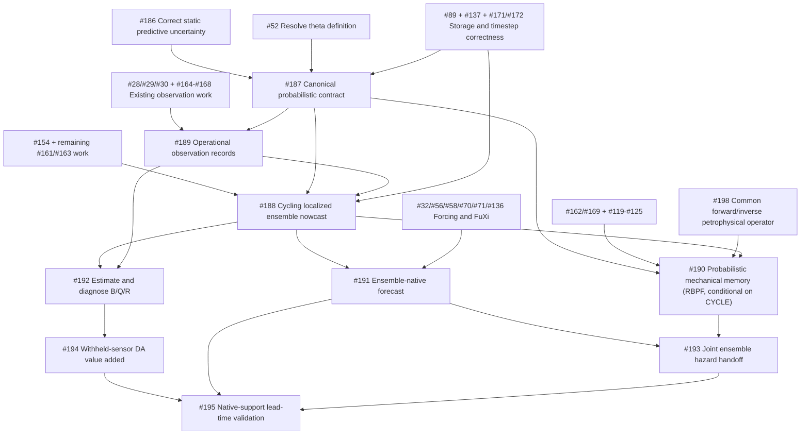

# Fully probabilistic nowcast and forecast roadmap

**Repository:** [`gaia-hazlab/gwl-space-time-smooth`](https://github.com/gaia-hazlab/gwl-space-time-smooth)  
**Prepared:** 2026-07-20  
**Local code audited:** branch `docs/digital-twins-review-and-gif`, commit `79df9fae25ca86f266224412111fbc9078bbd1d8`

This document is a queue-planning handoff. It reconciles the new probabilistic issues with the
implementation, documentation, tests, roadmap, and existing GitHub milestones. It is intended to be
reviewed before reordering or dispatching issues through the automated GitHub issue queue.

## Objective

Transform the current deterministic forecast plus snapshot BLUE corrections into a probabilistic
forecast-analysis system that:

1. represents the joint uncertainty of hydrologic storage, parameters, meteorological forcing,
   observation errors, model discrepancy, and mechanical memory;
2. reduces nowcast uncertainty where ground observations genuinely constrain the state;
3. carries the posterior ensemble into the forecast rather than restarting from a deterministic state;
4. maintains auditable water accounting, including explicit data-assimilation increments;
5. validates every prediction through the observation operator at the sensor's native spatial,
   temporal, and depth support; and
6. passes coherent ensemble members—not independent marginal sigma layers—to hazard models.

## What the repository already contains

The new work should build on these foundations rather than recreate them.

### Hydrologic and forecast foundations

- A frozen western-Cascades 90 m domain with approximately 2.96 million cells.
- A daily coupled soil-water, groundwater, snow, interflow, runoff, and baseflow model.
- Calibration against distinct observed quantities: well seasonal amplitude, basin runoff coefficient,
  baseflow index, and SNOTEL snowmelt timing.
- A deterministic `ForecastForcing`/`SoilStateForecast` path with precipitation, temperature, PET,
  snow partition/melt, groundwater, soil moisture, dv/v, and Vs diagnostics.
- A FuXi adapter that produces precipitation and temperature and refuses zero-placeholder rainfall.
  The adapter is written but the full GPU forecast sweep has not yet run.
- Cross-forcing soil-moisture spread and a GWL method/forcing-ensemble issue, but not yet a joint
  state ensemble propagated by forecast lead.

### Observation and assimilation foundations

- Native-support point, satellite, channel, basin, and seismic-footprint concepts.
- NWIS, SNOTEL/SCAN/USCRN, SMAP, USGS-discharge, and seismic data plumbing at various stages of
  operational readiness.
- Correct upscale-then-compare/native-support validation primitives.
- A static observation-space BLUE returning the analysis mean and posterior marginal variance.
- The correct OU lag treatment is landed: stale observations have reduced operator gain and added
  state-drift variance.
- A Matérn prior and hydrographic-region masking are landed.
- Processing-ensemble dv/v uncertainty and covariance machinery exist in `src/models/dvv.py`.
- Static coverage, PIT, CRPS, and hydrogeologic-domain validation machinery exist.

### Remaining limitations visible in the code

- The wet-season twin applies independent BLUE analyses to frames along a deterministic trajectory.
  Posterior covariance is discarded instead of becoming the next forecast covariance.
- The full-domain prior is still dense; the GIF works around this with a coarse assimilation grid and
  interpolation back to the display grid.
- Observation error is diagonal in `blue_update`, even though dv/v and retrieval errors can be
  correlated.
- `ForecastForcing` and `SoilStateForecast` do not carry an `ensemble_member` dimension.
- The uncertainty stack combines marginal components in quadrature, zero-fills missing components,
  and the Stage-3 normal-score kriging variance is labeled in physical units without a probabilistic
  back-transform.
- Mechanical state evolution is planned, and `soil_mechanics.py` remains a scaffold; it is not yet a
  conditionable stochastic state coupled to the forecast.

## Important reconciliation: calibrated performance versus structural physics debt

The current `ROADMAP.md` correctly records that the daily model reproduces observed BFI, runoff
coefficient, water-table amplitude, and seasonal phase after the western-Cascades and snow work. That
is valuable empirical calibration and must not be erased from the project narrative.

The newer water-budget review issues [#171–#177](https://github.com/gaia-hazlab/gwl-space-time-smooth/issues/171)
identify a different question: whether the internal storage partition and cross-reservoir transfers are
structurally defensible for probabilistic cycling and event forecasts. In particular, capillary rise is
added to root-zone storage without an equal groundwater debit, and there is no explicit vadose/transit
store between root-zone drainage and groundwater response.

Queue interpretation:

- The existing calibrated daily budget is the valid deterministic baseline and can support small
  probabilistic prototypes.
- Production probabilistic release remains gated by the storage-account, timestep, and held-out
  calibration work in [#89](https://github.com/gaia-hazlab/gwl-space-time-smooth/issues/89),
  [#137](https://github.com/gaia-hazlab/gwl-space-time-smooth/issues/137), and
  [#171/#172](https://github.com/gaia-hazlab/gwl-space-time-smooth/issues/172).
- A vadose/transit store should be justified by mass accounting and event dynamics. It should not be
  tuned merely to repair seasonal phase: the repository has already shown that snowmelt is the main
  seasonal clock and an added positive lag would make the remaining one-month delay worse.

## New issues submitted

| Priority | Issue | Purpose | Milestone placement |
|---|---|---|---|
| P0 | [#186](https://github.com/gaia-hazlab/gwl-space-time-smooth/issues/186) | Back-transform Stage-3 kriging predictive variance and stop mixing uncertainty units | v0.2 / milestone 1 |
| P0 | [#187](https://github.com/gaia-hazlab/gwl-space-time-smooth/issues/187) | Canonical ensemble/state/forcing/parameter/observation contract | DA correctness / milestone 9 |
| P1 | [#188](https://github.com/gaia-hazlab/gwl-space-time-smooth/issues/188) | Cycling localized ensemble nowcast with persistent covariance and DA-increment ledger | DA correctness / milestone 9 |
| P1 | [#189](https://github.com/gaia-hazlab/gwl-space-time-smooth/issues/189) | Operational observation records, operators, QC, datum age, R blocks, and holdouts | DA correctness / milestone 9 |
| P2 | [#190](https://github.com/gaia-hazlab/gwl-space-time-smooth/issues/190) | Probabilistic and conditionable damage/disturbance/healing states | Memory/disturbance / milestone 5 |
| P1 | [#191](https://github.com/gaia-hazlab/gwl-space-time-smooth/issues/191) | Ensemble-native forecast initialized from the DA posterior | Proposed v0.7 |
| P1 | [#192](https://github.com/gaia-hazlab/gwl-space-time-smooth/issues/192) | Estimate and diagnose B, Q, and R | DA correctness / milestone 9 |
| P2 | [#193](https://github.com/gaia-hazlab/gwl-space-time-smooth/issues/193) | Propagate joint ensembles through landslide and liquefaction pathways | Proposed v0.7, then hazard milestones |
| P1 | [#194](https://github.com/gaia-hazlab/gwl-space-time-smooth/issues/194) | Demonstrate nowcast uncertainty/error reduction on withheld sensors | DA correctness / milestone 9 |
| P1 | [#195](https://github.com/gaia-hazlab/gwl-space-time-smooth/issues/195) | Probabilistic validation by lead time and native observation support | Proposed v0.7 |

## Recommended milestone change

Create a milestone named:

> **v0.7 — Probabilistic nowcast and ensemble forecast**

Assign [#191](https://github.com/gaia-hazlab/gwl-space-time-smooth/issues/191),
[#193](https://github.com/gaia-hazlab/gwl-space-time-smooth/issues/193), and
[#195](https://github.com/gaia-hazlab/gwl-space-time-smooth/issues/195) to it. Consider moving the
currently unmilestoned forecast epic [#73](https://github.com/gaia-hazlab/gwl-space-time-smooth/issues/73),
forcing ensemble [#32](https://github.com/gaia-hazlab/gwl-space-time-smooth/issues/32), and forward
forcing [#71](https://github.com/gaia-hazlab/gwl-space-time-smooth/issues/71) into the same milestone.

Milestone 9 should own the estimator and nowcast machinery. Milestone v0.7 should own posterior
initialization, ensemble forcing/forecasting, forecast verification, and cross-hazard ensemble handoff.

## Dependency graph



## Queue sequence

The queue should use dependency readiness, not issue-number order.

### Phase 0 — Queue hygiene and truth alignment

Before dispatching major implementations:

1. Update [#161](https://github.com/gaia-hazlab/gwl-space-time-smooth/issues/161) to mark the OU
   lagged-observation subtask as landed while keeping dynamical covariance propagation open.
2. Update [#163](https://github.com/gaia-hazlab/gwl-space-time-smooth/issues/163) to mark Matérn and
   region masking as landed while keeping full-resolution scalable covariance/precision open.
3. Reconcile [#71](https://github.com/gaia-hazlab/gwl-space-time-smooth/issues/71) with the actual
   implementation: FuXi is the preferred +1–15 day precipitation/temperature model;
   `GraphCastOperational` cannot supply valid precipitation and is explicitly refused.
4. Audit [#28](https://github.com/gaia-hazlab/gwl-space-time-smooth/issues/28) because SNOTEL/SCAN
   fetch and validation components are already present; leave only operational anchoring/DA work open.
5. Correct the title/body alignment of #121–#123. In the current GitHub bodies, the content for
   surface disturbance, attribution, and event catalog appears shifted relative to the titles and
   `ROADMAP.md` descriptions.
6. Keep [#5](https://github.com/gaia-hazlab/gwl-space-time-smooth/issues/5) closed as the static
   calibration foundation. Dynamic calibration is now explicitly tracked in #194/#195.

### Phase 1 — Critical probabilistic foundations

Run in parallel where possible:

- **Uncertainty lane:** #186, then feed the corrected distribution into #187.
- **State-definition lane:** #52 and the schema design in #187.
- **Water lane:** #89, #137, #171/#172 and directly dependent storage issues.
- **Scale lane:** #154 plus the remaining scalable part of #163.
- **Observation-error lane:** #164/#165/#168.

Exit gate:

- all stochastic variables have declared units/support/provenance;
- missing uncertainty is not silently zero;
- storage variables and diagnostics have one unambiguous relationship;
- member-level water accounting and DA increments can be audited; and
- no production plan requires a dense full-domain covariance.

### Phase 2 — Observation layer and cycling nowcast

Recommended order:

1. #187 canonical contract.
2. #189 operational observation records and fixed holdouts.
3. #188 cycling localized EnKF/LETKF pilot.
4. #192 B/Q/R estimation, localization, inflation, and innovation diagnostics.
5. #194 open-loop versus DA comparison on withheld sensors.

The first #188 prototype may use the current calibrated daily model, a small spatial fixture, and a
limited hydrologic state. Do not wait for every hazard or mechanical issue. Production claims and
full-domain cycling wait for the water and scale exit gates.

**Filter architecture note.** #188 is scoped to exactly the state where the observation operator is
linear — GWL (head) and soil moisture ($\theta$), observed through the point footprints of NWIS wells and
SNOTEL/SCAN/USCRN. That is the deliberate boundary: this phase is an EnKF (`blue_update` with the
ensemble covariance standing in for $B$), not a general nonlinear filter, because wells/SNOTEL are linear
in the state and the Rung-2/Rung-3 forecast is linear or ensemble-handled. dv/v does **not** enter #188 at
full fidelity yet — it enters today through its linearized $k_{sat}\Delta h$ / $S_\theta\Delta\theta$
coefficients, same as any other linear observation, which is an accepted, explicit approximation, not an
oversight. See [Assimilation §"Linear versus nonlinear observation operators"](twin/04-assimilation.qmd)
for the full justification and its handoff to Phase 4.

Nowcast acceptance:

- posterior members become the next forecast's initial members;
- DA contracts uncertainty primarily in the observed subspace, not artificially everywhere;
- CRPS and error improve on wholly withheld stations;
- interval coverage remains calibrated;
- correlated observations are not double-counted; and
- analysis storage increments are explicit, while model-step internal transfers close.

### Phase 3 — Ensemble meteorological and hydrologic forecast

After a stable hydrologic cycling pilot:

1. Finish FuXi execution and orographic/bias-correction work in #136/#71.
2. Extend #32 from time-mean cross-method sigma to member-level forcing/method uncertainty.
3. Implement #191 so posterior initial conditions, precipitation, temperature, PET/snow physics,
   parameters, and process discrepancy retain member identity through lead time.
4. Preserve precipitation-temperature dependence. Do not independently shuffle members.

Forecast acceptance:

- the one-member limit matches the deterministic forecast;
- lead-zero covariance matches the DA posterior;
- spread evolves with lead and is not a copied static sigma raster;
- every member satisfies storage bounds/accounting; and
- uncertainty sources remain separable in metadata and diagnostics.

### Phase 4 — Probabilistic mechanical memory

Run #190 after #187; its synthetic transition-model work can proceed in parallel with hydrologic
forecast development. Conditioning and attribution wait for #162/#169 and defensible dv/v operators.

Required separation:

- hydrologic storage states;
- coseismic stiffness/damage state;
- surface-disturbance state;
- post-fire hydraulic/root-cohesion state; and
- event catalog/forcing.

Slow damage/healing remains firewalled from seconds-scale liquefaction triggering as required by #145.

**Filter architecture for this phase: a Rao-Blackwellized particle filter (RBPF), conditional on the
#188 EnKF, not a filter of its own.** #190's damage/healing state and the dv/v-derived petrophysical
state (hysteresis branch, effective saturation) are exactly the node where a Gaussian filter — EnKF or
extended Kalman alike — stops being honest: the underlying chain (Hertz–Mindlin contact modulus, a
retention-curve capillary term, a rate-dependent dynamic-capillarity term) is nonlinear and hysteretic,
so a single $\delta v/v$ reading can be consistent with more than one $(\theta,\text{history})$ state at
once. #198 (common forward/inverse petrophysical operator) is the prerequisite that makes this
nonlinearity real rather than assumed — today's $k_{sat}$/$S_\theta$ constants are its linearization, and
#190 should not build particle machinery before #198 lands.

Design (spelled out with justification in
[Assimilation §"The concrete two-tier filter"](twin/04-assimilation.qmd)):

- Partition the state at the seam where linearity stops: $x_{\rm lin}$ (GWL, soil moisture — #188's EnKF)
  and $x_{\rm nl}$ (hysteresis branch, effective saturation, damage/healing amplitude — a particle
  ensemble, small and per-region, not per-cell-of-the-full-domain).
- Each particle propagates $x_{\rm nl}$ through the real nonlinear/hysteretic transition model (no
  linearization); conditional on a particle's trajectory, the dv/v sensitivity coefficients are fixed
  numbers, so dv/v (like wells and SNOTEL) becomes **linear in $x_{\rm lin}$ given the particle** — this
  is what makes marginalizing $x_{\rm lin}$ into #188's EnKF valid rather than merely convenient, and why
  this is not a full particle filter over the whole state.
- Particle weights update from the exact conditional likelihood of the full data vector at each
  trajectory, with resampling when effective sample size drops.
- Localize $x_{\rm nl}$ using the same terrain-aware `region_id` blocking already built for the spatial
  prior $B$ (issue #163) — reused, not reinvented, to keep the particle dimension tractable.
- Explicit approximation to flag, not hide: once Rung-3 (ParFlow-ML) is in the forecast loop, the
  "conditional Kalman filter" for $x_{\rm lin}$ becomes a **conditional EnKF** — an approximation to the
  textbook Rao-Blackwellized construction, which is exact only for a linear-Gaussian forecast model.
  Document this as a controlled approximation in the eventual #190 write-up, not as exact marginalization.
- A new dependency edge belongs in the graph above: `CYCLE["#188 EnKF"] --> MECH["#190, as an RBPF
  conditional on #188"]`, in addition to the existing `CONTRACT --> MECH` and `ATTRIB --> MECH` edges.

### Phase 5 — Joint hazard ensembles

Run #193 only after member identity is stable in #191 and, where used, #190.

- Landslides: evaluate factor of safety member by member and report `P(FS < 1)`.
- Liquefaction: evaluate the published susceptibility model member by member while retaining the
  product's susceptibility-screen scope.
- Preserve cross-variable and spatial correlations; include a regression test showing how independent
  marginal sampling changes tail probability.

### Phase 6 — Probabilistic hindcast and release gate

Use #195 to execute rolling wet-season initializations already anticipated by
`src/data/stage_mvp_window.py`.

Score:

- meteorological forecasts against PRISM/stations by lead;
- lead-zero analyses and open-loop states against withheld ground observations;
- forecasts against wells, probes, gauges, SMAP/GRACE/dv/v through native-support operators; and
- hazard thresholds with reliability and Brier scores.

Required metrics include CRPS/CRPSS, coverage, PIT/rank histograms, spread-skill, bias, RMSE, and
multivariate energy score where tractable. ERA5-Land and NLDAS remain model intercomparisons, not
ground truth.

## Water-budget and DA accounting rule

The forecast model and the analysis solve different accounting problems:

- During model propagation, internal transfers must cancel and external fluxes must close the storage
  change.
- During analysis, observations may imply that prior storage was wrong. The resulting
  `delta_storage_DA` is a legitimate inference increment, not a physical rainfall/recharge flux.
- After the analysis, diagnostic head, DTW, theta, saturation, and pore-pressure variables must be
  recomputed from corrected storage; they must not be independently adjusted.

Every cycle should therefore publish both:

```text
model_closure_residual
delta_storage_DA
```

Conflating them would either force the analysis to preserve an erroneous prior mass or allow hidden
non-conservation in the model.

## Native-support validation rule

All residuals must be formed in observation space:

```text
residual_i = observed_i - H_i(ensemble state)
```

where `H_i` represents the actual point/depth, satellite pixel, coda volume, channel, or basin support.
A coarse retrieval must never be downscaled to 90 m and counted as many independent observations.

Assimilation, calibration, and validation roles must be assigned before the run. An assimilated sensor
cannot be reused as independent validation; at least one experiment must hold out entire stations and
contiguous time blocks.

## Suggested execution order for an automated issue agent

The following is a conservative topological order. Items on the same line can be developed in parallel
if their files do not conflict.

```text
Queue cleanup: #161, #163, #71, #28, #121-#123

Foundation A: #186, #52
Foundation B: #89, #137, #171, #172
Foundation C: #154, #164, #165, #168

#187
#189
#188
#192
#194             || #71/#136/#32
#191             || #190 synthetic transition work (RBPF design, no #198 dependency yet)
#198             (blocks #190's RBPF conditioning on real dv/v; #190's synthetic-transition work above does not wait for it)
#193
#195
```

Do not dispatch #193 before #191. Do not claim operational nowcast completion at #188 alone; #192 and
#194 are its calibration and evidence gates. Do not close #161 merely because the OU formula landed;
the dynamical propagation requirement remains open until #188 is functioning. Do not build #190's
Rao-Blackwellized particle filter conditioning on real dv/v sensitivity coefficients before #198 lands —
its synthetic transition-model work (branch/damage dynamics, particle mechanics, resampling) can and
should proceed in parallel with #188, but the conditional-linearity argument that makes the filter
Rao-Blackwellized rather than a full joint particle filter depends on #198's real $k_{sat}(x_{\rm
nl})$/$S_\theta(x_{\rm nl})$ coefficients, not the current fixed constants.

## Scope boundaries

- This roadmap forecasts hydrologic antecedent state, not a routed flood hydrograph.
- A 90 m delivered product does not create information finer than its native inputs.
- FuXi currently has the intended forecast horizon; GraphCast Operational's zero precipitation is not
  a usable ensemble member.
- Soil-mechanics and hazard probabilities must not outrun their validation anchors.
- Mechanical damage/healing and hydrologic pore pressure may share observations but are distinct states
  with different physics and timescales.
- Mean plus sigma products may be exported for convenience, but ensemble members are the authoritative
  probabilistic representation.

## Proposed definition of v0.7 complete

The milestone is complete when:

1. Stage-3 predictive uncertainty is in physical units and passes recalibrated coverage checks.
2. A canonical member-preserving state/forcing/parameter/observation Zarr contract is tested.
3. A cycling localized ensemble nowcast operates without a dense full-domain covariance.
4. Ground sensors reduce CRPS/error on fully withheld observations while retaining calibrated coverage.
5. Posterior members initialize a precipitation-temperature ensemble forecast through +15 days.
6. Forecast skill and calibration are reported by lead time and native support.
7. Model closure residuals and DA storage increments are separately auditable.
8. At least one downstream hazard pathway consumes joint members and emits calibrated probability or
   reliability-ready outputs.
9. Mechanical-memory uncertainty is either propagated through the relevant hazard path or explicitly
   excluded and documented for that release.
10. The filter architecture is explicit and matches the state's own linearity: an EnKF over GWL/soil
    moisture (#188), and — only once #198's forward/inverse petrophysical operator lands and #190 is
    built — a Rao-Blackwellized particle filter over the hysteresis/damage node, conditional on that
    EnKF, not a separate unconditioned filter. Until #198 lands, dv/v's linearized assimilation ($k_{sat}$,
    $S_\theta$) is an accepted, documented approximation, not a silent one.

